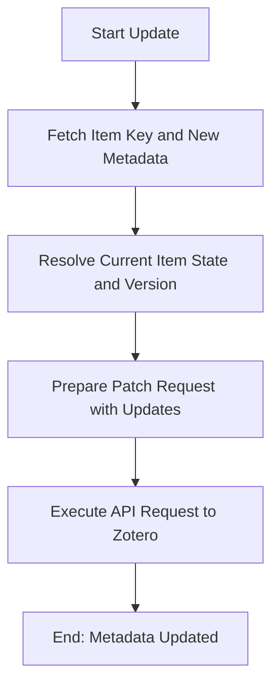

# DOC-SPEC: item update

## 1. Classification
- **Level:** 🟡 MODIFICATION (Metadata Correction)
- **Target Audience:** Researcher / Author

## 2. Logic Flow (Visual Synthesis)

## 3. Synopsis
Corrects or enhances the metadata of an individual Zotero item, including fields such as Title, DOI, and Abstract.

## 4. Description (Instructional Architecture)
The `item update` command is the standard way to fix inaccuracies in paper metadata after an import. It allows you to modify core bibliographic fields directly from the terminal without using the Zotero GUI. 

The command supports both targeted field updates (via `--title`, `--doi`, etc.) and a powerful `--json` mode for complex metadata changes. It uses the `PATCH` method of the Zotero API to ensure that only the specified fields are changed, leaving the rest of the metadata intact. The `--version` identifier ensures that updates are only applied to the most recent version of the item to prevent synchronization conflicts.

## 5. Parameter Matrix
| Flag | Type | Description | Ergonomic Note |
| :--- | :--- | :--- | :--- |
| `--key` | String | Unique Zotero Item Key (e.g., `ABCD1234`). | Required. |
| `--doi` | String | The correct Digital Object Identifier. | Optional. |
| `--title` | String | The correct title of the paper. | Optional. |
| `--abstract` | String | The correct abstract of the paper. | Optional. |
| `--json` | String | Raw JSON string representing all fields to update. | Optional. Powerful for advanced users. |
| `--version` | Integer | The version identifier for concurrency protection. | Optional. Auto-resolved if omitted. |

## 6. Scenario-Based Examples (Cognitive Anchors)
### Scenario: Correcting a title with typos
**Problem:** My paper with key `ABCD1234` has a typo in the title: "Attension is all you need."
**Action:** `zotero-cli item update --key "ABCD1234" --title "Attention is All You Need"`
**Result:** The title is correctly updated in the Zotero library.

## 7. Cognitive Safeguards
- **Common Failure Modes:** Attempting to update an item using a malformed JSON string. Always validate your JSON structure before running the command. 
- **Safety Tips:** Use the targeted flags (`--title`, `--doi`) for simple corrections. Reserved for the most experienced users, the `--json` flag can modify *any* Zotero field if correctly formatted.
