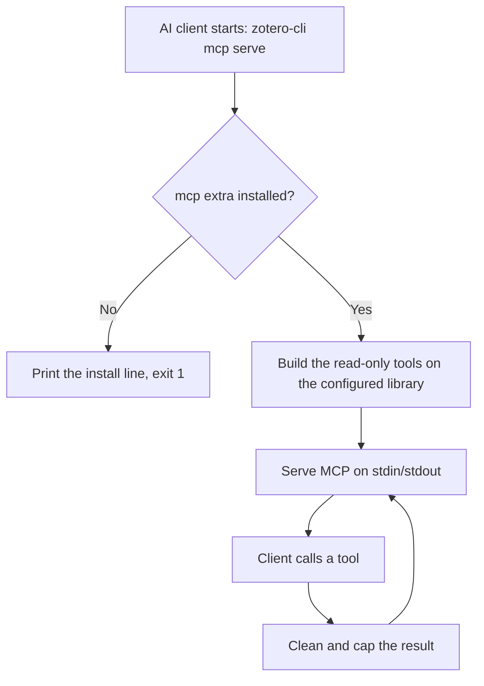

# DOC-SPEC: mcp serve

## 1. Classification
- **Level:** 🟢 READ-ONLY (Server; every tool only reads)
- **Target Audience:** AI-client user / Agent builder

## 2. Logic Flow (Visual Synthesis)

## 3. Synopsis
Runs a Model Context Protocol server on stdin/stdout so an AI client can read your Zotero library.

## 4. Description (Instructional Architecture)
`mcp serve` is not run by hand: you add it to your AI client's MCP configuration (`{"command": "zotero-cli", "args": ["mcp", "serve"]}`, with `--offline` before `mcp` to read the local database), and the client starts it and talks to it over stdin/stdout. Nothing listens on a network port. It offers nine read-only tools: `search_items` (keyword, filters, and with `--offline` search inside the PDFs), `get_item`, `list_items`, `list_collections`, `list_tags`, `get_annotations`, `get_item_text`, `get_bibliography` and `describe_cli`. Results are structured data with control characters removed and sizes capped. It needs the optional extra `zotero-command-line[mcp]`.

## 5. Parameter Matrix
| Flag / Parameter | Type | Description | Ergonomic Note |
| :--- | :--- | :--- | :--- |
| *(none)* | | `mcp serve` takes no options of its own. | The global `--offline`, `--user` and `--config` go before `mcp`. |

## 6. Scenario-Based Examples (Cognitive Anchors)
### Scenario: Letting an AI client search my library
**Problem:** I want an AI client to find papers in my Zotero library.
**Action:** add `{"command": "zotero-cli", "args": ["mcp", "serve"]}` to the client's MCP configuration.
**Result:** The client starts the server itself and can call the read-only tools.

### Scenario: The same, offline, with full-text search
**Problem:** I want it to search inside my PDFs and not use the network.
**Action:** use `{"command": "zotero-cli", "args": ["--offline", "mcp", "serve"]}`.
**Result:** Reads come from the local `zotero.sqlite`, and `search_items` accepts `fulltext`.

## 7. Cognitive Safeguards
- **Common Failure Modes:** The extra isn't installed (the command prints `pip install 'zotero-command-line[mcp]'` and exits 1); no library is configured (run `zotero-cli init`); running it in a terminal just waits for a client.
- **Safety Tips:** Library text is untrusted: other people may have written titles, notes or annotations in a shared library. The server tells the client not to follow instructions found in them, but connect only clients you trust. There are no write tools.
