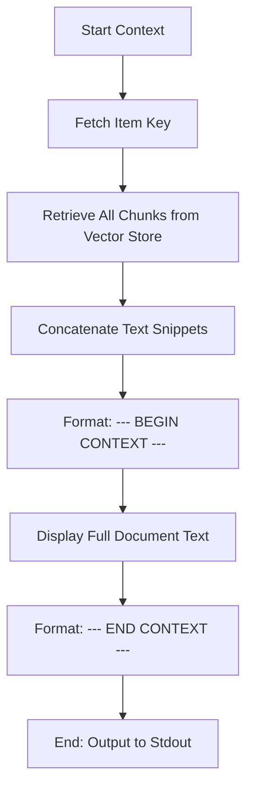

# DOC-SPEC: rag context

## 1. Classification
- **Level:** 🟢 READ-ONLY (Context Reconstruction)
- **Target Audience:** Researcher / AI Developer

## 2. Logic Flow (Visual Synthesis)

## 3. Synopsis
Aggregates all textual snippets and metadata belonging to a specific item to reconstruct its original context for LLM ingestion.

## 4. Description (Instructional Architecture)
The `rag context` command is the "Extraction Layer" for LLMs. While `rag query` finds specific points of interest, `rag context` extracts the entire indexed representation of a single paper. 

This command is essential for workflows that involve detailed summarization or cross-referencing within a single document. It retrieves all text chunks associated with a specific Zotero Item Key (which must have been previously indexed via `rag ingest`) and presents them as a continuous stream of text, framed for easy consumption by an LLM prompt.

## 5. Parameter Matrix
| Flag | Type | Description | Ergonomic Note |
| :--- | :--- | :--- | :--- |
| `--key` | String | Unique Zotero Item Key (e.g., ABCD1234). | Required. |

## 6. Scenario-Based Examples (Cognitive Anchors)
### Scenario: Summarizing a single paper via LLM
**Problem:** I want to generate a 500-word summary of a specific paper in my collection using a local LLM.
**Action:** `zotero-cli rag context --key "W2A3B4C5" > paper_context.txt`
**Result:** The file `paper_context.txt` now contains the full text of the paper as extracted during ingestion. This file can be piped directly into an LLM prompt.

## 7. Cognitive Safeguards
- **Common Failure Modes:** Attempting to retrieve context for an item that has not been ingested. The command will output a "No context found" warning.
- **Safety Tips:** Context outputs can be very large. When piping into LLMs, ensure the total context length doesn't exceed the model's token limit.
