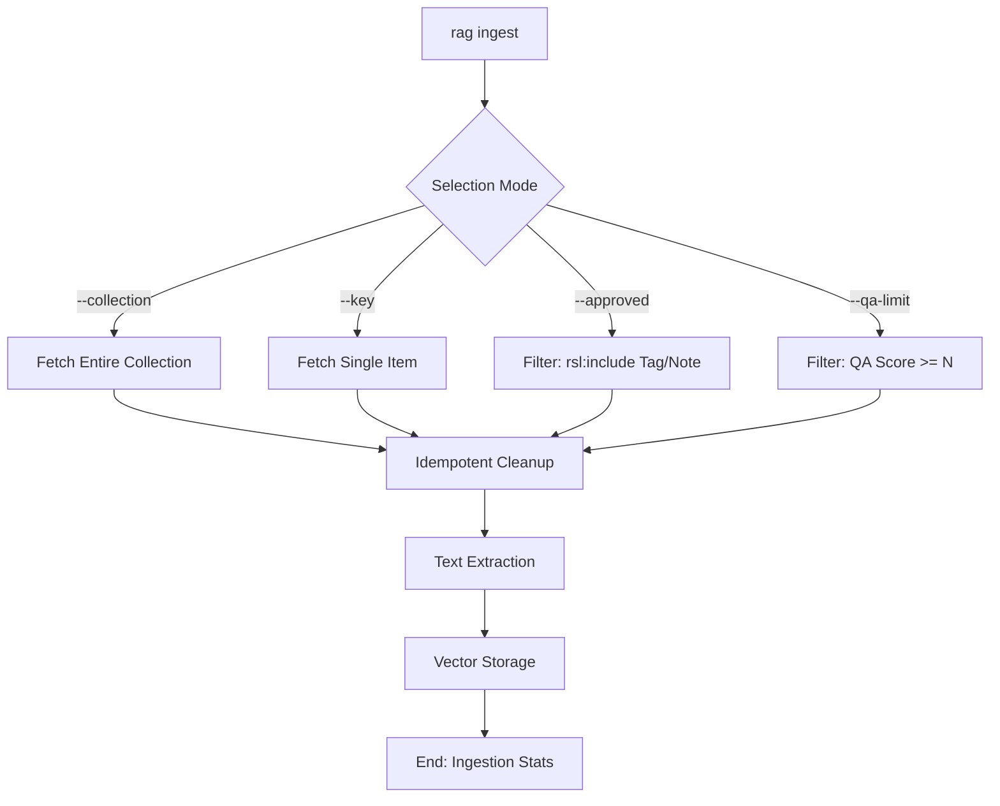

# DOC-SPEC: rag ingest

## 1. Classification
- **Level:** 🟡 MODIFICATION (Vector Store Update)
- **Target Audience:** Researcher / AI Engineer

## 2. Logic Flow (Visual Synthesis)

## 3. Synopsis
Populates the local vector database with the text content of papers from Zotero, enabling semantic search and context retrieval. Supports targeted ingestion of collections, individual items, or papers passing specific quality thresholds.

## 4. Description (Instructional Architecture)
The `rag ingest` command is the "Ghost Process" that bridges your Zotero library and the AI-powered search engine. It processes items based on the selected mode, identifies PDF attachments, and extracts their textual content. 

**Idempotency Guarantee:** Every `ingest` operation automatically clears existing chunks for the target items before re-indexing. This prevents duplicate results and uncontrolled database growth.

This content is then fragmented into smaller chunks and transformed into high-dimensional vectors (embeddings) stored in a local SQLite database.

## 5. Parameter Matrix
| Flag / Parameter | Type | Description | Ergonomic Note |
| :--- | :--- | :--- | :--- |
| `--approved` | Boolean | Ingest only approved items (rsl:include) | Optional. Default: False. |
| `--collection` | String | Collection name or key | Optional. |
| `--key` | String | Single item key | Optional. |
| `--no-prune` | Boolean | Append to the vector store (Default) | Optional. Default: True. |
| `--prune` | Boolean | Clear the vector store before ingestion | Optional. Default: False. |
| `--qa-limit` | Float | Minimum extraction QA score threshold | Optional. |
| `--tree` | String | Source collection name or key (only applicable with qa-approved target) | Optional. |
| `target` | String | Optional ingestion target (e.g. qa-approved) | Optional. |

## 6. Scenario-Based Examples (Cognitive Anchors)
### Scenario: Preparing a collection for semantic analysis
**Action:** `zotero-cli rag ingest --collection "Transformer Papers"`
**Result:** The CLI indexes all papers in the specified collection.

### Scenario: Indexing only high-quality screened papers
**Action:** `zotero-cli rag ingest --approved --qa-limit 0.8`
**Result:** Only items that passed screening (`rsl:include`) AND have a recorded QA score of 0.8 or higher are indexed.

### Scenario: Quick update for a single new paper
**Action:** `zotero-cli rag ingest --key "T364VKT5"`
**Result:** Only the specified paper is indexed (or updated if it already existed).

## 7. Cognitive Safeguards
- **Common Failure Modes:** Attempting to ingest items without local PDF attachments or missing extraction notes when using `--qa-limit`.
- **Safety Tips:** Ingestion is computationally expensive. Use targeted modes (`--key`, `--approved`) to save resources and avoid redundant processing of low-quality material.
