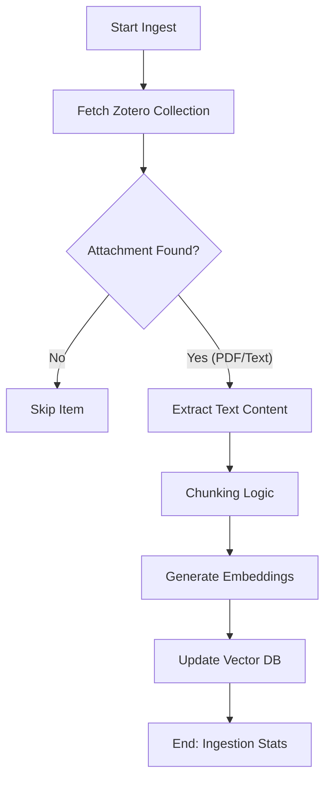

# DOC-SPEC: rag ingest

## 1. Classification
- **Level:** 🟡 MODIFICATION (Vector Store Update)
- **Target Audience:** Researcher / AI Engineer

## 2. Logic Flow (Visual Synthesis)

## 3. Synopsis
Populates the local vector database with the text content of papers from a Zotero collection, enabling semantic search and context retrieval.

## 4. Description (Instructional Architecture)
The `rag ingest` command is the "Ghost Process" that bridges your Zotero library and the AI-powered search engine. It traverses a specified collection, identifies PDF attachments, and extracts their textual content. 

This content is then fragmented into smaller, overlapping chunks and transformed into high-dimensional vectors (embeddings). These vectors are stored in a local persistent database (Vector Store), allowing the `rag query` command to find information based on conceptual meaning rather than just keyword matching.

## 5. Parameter Matrix
| Flag | Type | Description | Ergonomic Note |
| :--- | :--- | :--- | :--- |
| `--collection` | String | Name or Key of the source collection. | Required. Items must have PDF attachments. |

## 6. Scenario-Based Examples (Cognitive Anchors)
### Scenario: Preparing a collection for semantic analysis
**Problem:** I have a collection of 50 papers on "Transformer Architectures" and I want to ask questions about their specific implementation details across the whole set.
**Action:** `zotero-cli rag ingest --collection "Transformer Papers"`
**Result:** The CLI extracts text from the PDFs in that folder, generates embeddings, and indexes them. They are now searchable via `rag query`.

## 7. Cognitive Safeguards
- **Common Failure Modes:** Attempting to ingest a collection where items lack local PDF attachments. The command will skip items without indexable text.
- **Safety Tips:** Ingestion is computationally expensive (CPU/GPU). For very large collections (>1000 papers), process them in batches to monitor system resources.
