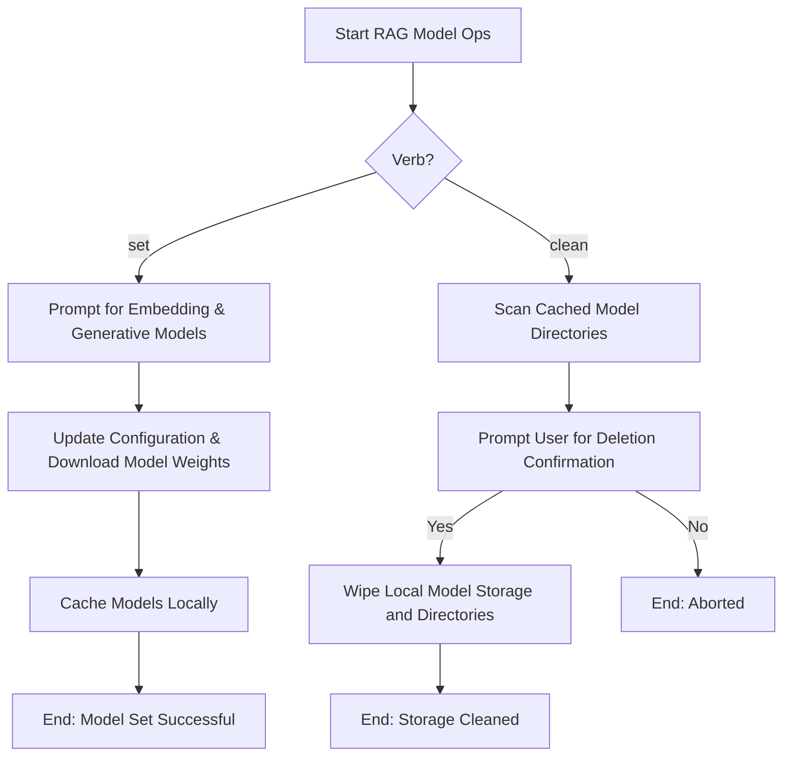

# DOC-SPEC: rag model

## 1. Classification
- **Level:** [🟢 READ-ONLY (Model Ingestion) | 🔴 DESTRUCTIVE (Model Cleanup)]
- **Target Audience:** Researchers / SysAdmins

## 2. Logic Flow (Visual Synthesis)

## 3. Synopsis
Manages local embedding and generative AI model selection, downloads, and storage cleanup.

## 4. Description (Instructional Architecture)
The `rag model` namespace contains subcommands to configure local models:
- **`set`**: Launches an interactive wizard allowing you to select and pre-download specific Embedding and Generative models (e.g. Kokoro, local LLMs) and write their IDs to the configuration.
- **`clean`**: Frees local disk space by discovering downloaded model cache folders and permanently deleting them.

## 5. Parameter Matrix
| Flag / Parameter | Type | Description | Ergonomic Note |
| :--- | :--- | :--- | :--- |

## 6. Scenario-Based Examples (Cognitive Anchors)
### Scenario: Deleting cached model weights to clear disk space
**Problem:** My local drive is full and I want to remove cached embedding models.
**Action:** `zotero-cli rag model clean`
**Result:** The CLI asks for confirmation and cleans up cached folders.

## 7. Cognitive Safeguards
- **Common Failure Modes:** Attempting to `set` a gated model (like Llama) without possessing a valid HuggingFace token.
- **Safety Tips:** Run `rag model clean` if your models are acting corrupted, then run `rag model set` to redownload.
