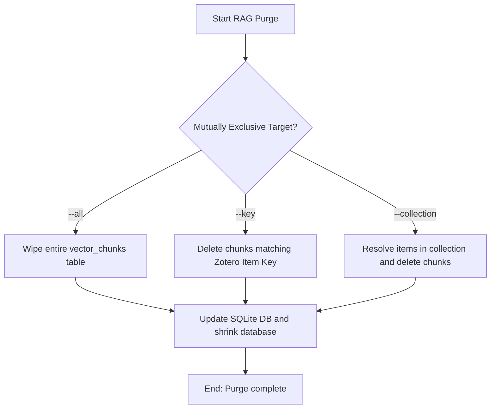

# DOC-SPEC: rag purge

## 1. Classification
- **Level:** 🔴 DESTRUCTIVE (Local Vector Storage Wipe)
- **Target Audience:** SysAdmin / Researcher

## 2. Logic Flow (Visual Synthesis)

## 3. Synopsis
Removes indexed paper chunks and embedding vectors from the local SQLite vector database to free up storage space.

## 4. Description (Instructional Architecture)
The `rag purge` command clears chunks and vectors from the local SQLite vector store. Over time, as research collections evolve or when papers are deleted from Zotero, the local vector index may contain orphaned records. You can selectively purge vectors by key or collection, or perform a complete wipe.

## 5. Parameter Matrix
| Flag / Parameter | Type | Description | Ergonomic Note |
| :--- | :--- | :--- | :--- |
| `--all` | Boolean | Clear all indexed data | Optional. Default: False. |
| `--collection` | String | Clear data for an entire collection | Optional. |
| `--key` | String | Clear data for a specific item key | Optional. |

## 6. Scenario-Based Examples (Cognitive Anchors)
### Scenario: Deleting RAG cache for a specific paper
**Problem:** I want to re-ingest a paper after updating its PDF text, so I need to wipe its current embeddings first.
**Action:** `zotero-cli rag purge --key "ABCD1234"`
**Result:** Chunks for paper `ABCD1234` are wiped from the vector database.

## 7. Cognitive Safeguards
- **Common Failure Modes:** Purging vectors does not affect original papers in Zotero, but requires re-running `rag ingest` before RAG querying works on those items.
- **Safety Tips:** Run `rag query` on the item after purging to confirm that no results are found.
