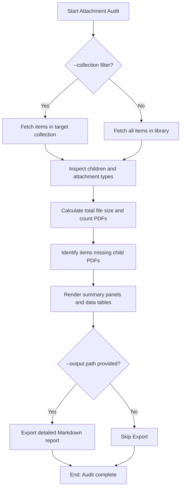

# DOC-SPEC: report attachments

## 1. Classification
- **Level:** 🟢 READ-ONLY (Attachment Audit)
- **Target Audience:** Researchers / SysAdmins

## 2. Logic Flow (Visual Synthesis)

## 3. Synopsis
Performs an audit of PDF attachments and other files in your library or a collection, detailing disk space usage and identifying items missing PDFs.

## 4. Description (Instructional Architecture)
The `report attachments` command lets you manage local disk usage and trace complete data coverage. It loops through all parent items in Zotero, checks their child attachments for PDFs, calculates total size in megabytes, and logs items that lack any attached PDF document.

## 5. Parameter Matrix
| Flag / Parameter | Type | Description | Ergonomic Note |
| :--- | :--- | :--- | :--- |
| `--collection` | String | Filter analysis to a specific collection | Optional. |
| `--output` | String | Optional path to save the Markdown attachments report | Optional. |

## 6. Scenario-Based Examples (Cognitive Anchors)
### Scenario: Finding space hogging attachments
**Problem:** My local Zotero storage quota is reaching its limit and I want to see a size audit.
**Action:** `zotero-cli report attachments --output "disk_report.md"`
**Result:** An audit report is compiled, showing size summary and exporting a list of items missing PDFs to a markdown file.

## 7. Cognitive Safeguards
- **Common Failure Modes:** Attempting to export to a directory that is not writable.
- **Safety Tips:** Run this command periodically to find items that require PDF fetching.
