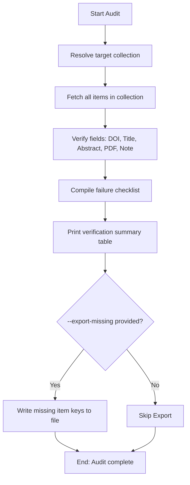

# DOC-SPEC: report audit

## 1. Classification
- **Level:** 🟢 READ-ONLY (Metadata Completion Verification)
- **Target Audience:** Researchers / SLR Leads

## 2. Logic Flow (Visual Synthesis)

## 3. Synopsis
Audits a specified collection to identify missing metadata (such as DOIs, abstracts, titles, or PDFs) and verify completeness.

## 4. Description (Instructional Architecture)
The `report audit` command checks if your research items are submission-ready. It verifies whether items possess a DOI/arXiv ID, a title, an abstract, an attached PDF, and a screening audit trail note. If any required field is missing, it lists them.

## 5. Parameter Matrix
| Flag / Parameter | Type | Description | Ergonomic Note |
| :--- | :--- | :--- | :--- |
| `--collection` | String | Collection Name or Key to validate | Required. |
| `--export-missing` | String | Path to export keys of missing items to a file | Optional. |
| `--verbose` | Boolean | Show detailed failure logs | Optional. Default: False. |

## 6. Scenario-Based Examples (Cognitive Anchors)
### Scenario: Verifying metadata completeness of selected items
**Problem:** I need to verify that all final papers have abstracts and DOIs.
**Action:** `zotero-cli report audit --collection "Final Selection" --verbose`
**Result:** A verification report is printed, showcasing completeness metrics.

## 7. Cognitive Safeguards
- **Common Failure Modes:** Attempting to audit a collection that is empty or does not exist.
- **Safety Tips:** Use `--export-missing` to write missing keys to a file, which can then be passed to `item hydrate` to retrieve metadata automatically.
