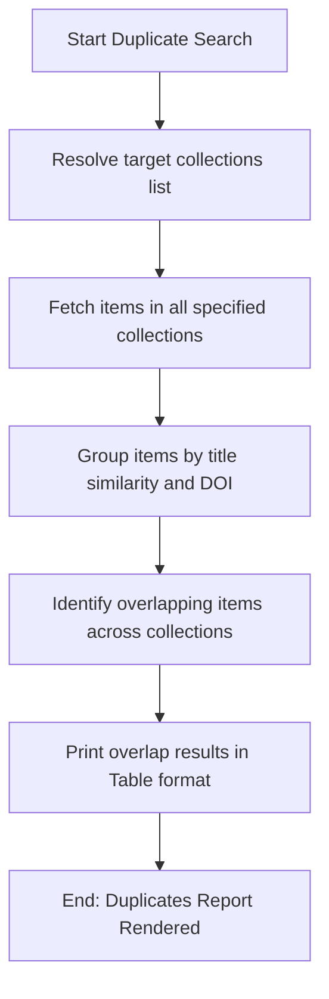

# DOC-SPEC: report duplicates

## 1. Classification
- **Level:** 🟢 READ-ONLY (Overlap Diagnostics)
- **Target Audience:** Researchers / SLR Leads

## 2. Logic Flow (Visual Synthesis)

## 3. Synopsis
Identifies duplicate papers that exist across multiple specified collections.

## 4. Description (Instructional Architecture)
The `report duplicates` command helps you find overlaps between search databases or folders. During an SLR, you might import search results from IEEE, ACM, and Springer into separate collections. This command matches records by exact DOI or normalized title comparison to locate duplicate entries.

## 5. Parameter Matrix
| Flag / Parameter | Type | Description | Ergonomic Note |
| :--- | :--- | :--- | :--- |
| `--collections` | String | Comma-separated list of collection names or keys | Required. |

## 6. Scenario-Based Examples (Cognitive Anchors)
### Scenario: Finding overlaps between IEEE and Springer search results
**Problem:** I want to check which papers appeared in both databases.
**Action:** `zotero-cli report duplicates --collections "IEEE_01,SPR_01"`
**Result:** A table listing the duplicate titles, DOIs, and item keys is displayed.

## 7. Cognitive Safeguards
- **Common Failure Modes:** Providing misspelled collection names.
- **Safety Tips:** Ensure collection names are spelt exactly right or use their unique 8-character keys.
