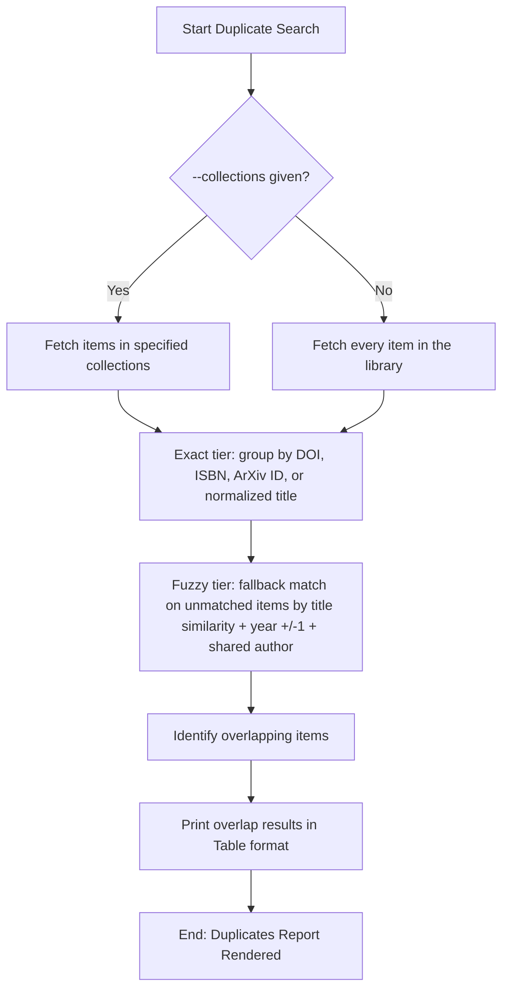

# DOC-SPEC: report duplicates

## 1. Classification
- **Level:** 🟢 READ-ONLY (Overlap Diagnostics)
- **Target Audience:** Researchers / SLR Leads

## 2. Logic Flow (Visual Synthesis)

```mermaid
graph TD
    A["Start Duplicate Search"] --> B{"--collections given?"}
    B -->|Yes| C["Fetch items in specified collections"]
    B -->|No| C2["Fetch every item in the library"]
    C --> D["Exact tier: group by DOI, ISBN, ArXiv ID, or normalized title"]
    C2 --> D
    D --> E["Fuzzy tier: fallback match on unmatched items by title similarity + year +/-1 + shared author"]
    E --> F["Identify overlapping items"]
    F --> G["Print overlap results in Table format"]
    G --> H["End: Duplicates Report Rendered"]
```

## 3. Synopsis
Identifies duplicate papers across specified collections, or the entire library if `--collections` is omitted, reporting which collection each copy came from and whether their SDB screening decisions agree.

## 4. Description (Instructional Architecture)
The `report duplicates` command helps you find overlaps between search databases or folders, or scan your whole library the way Zotero Desktop's own duplicate detection does. During an SLR, you might import search results from IEEE, ACM, and Springer into separate collections. This command first matches records by exact DOI, ISBN, ArXiv ID, or normalized title. Anything left unmatched is then run through a fuzzy fallback tier — similar (but not identical) title, publication year within 1 year, and at least one shared author last-name/first-initial — the same corroborating-signal approach Zotero Desktop uses when primary fields don't cleanly resolve. A fallback match between a `preprint` and a `journalArticle`/`conferencePaper` is labeled `preprint-published-pair` rather than plain `fuzzy`, since that's a common, distinct SLR case (a preprint and its later published version). For each duplicate group, existing SDB screening notes are looked up to flag whether the copies were screened consistently (`MATCHING`), inconsistently (`CONFLICTING`), or not yet screened (`UNSCREENED`).

## 5. Parameter Matrix
| Flag / Parameter | Type | Description | Ergonomic Note |
| :--- | :--- | :--- | :--- |
| `--collections` | String | Comma-separated list of collection names or keys | Optional — omit to scan the whole library instead. |
| `--csv` | String | Optional path to export the duplicate report as CSV | Includes match type, identifier, key, collection, and SDB status columns. |

## 6. Scenario-Based Examples (Cognitive Anchors)
### Scenario: Finding overlaps between IEEE and Springer search results
**Problem:** I want to check which papers appeared in both databases.
**Action:** `zotero-cli report duplicates --collections "IEEE_01,SPR_01"`
**Result:** A table listing the duplicate titles, keys, source collection, and SDB screening status is displayed.

### Scenario: Scanning the whole library, Desktop-style
**Problem:** I want duplicate detection across everything in my library, not just named collections.
**Action:** `zotero-cli report duplicates`
**Result:** Every item in the library is scanned; duplicate groups (exact and fuzzy) are reported the same way.

### Scenario: Exporting a duplicate report for methodological audit records
**Problem:** I need a CSV record of every duplicate found before pruning, for my SLR audit trail.
**Action:** `zotero-cli report duplicates --collections "IEEE_01,SPR_01" --csv duplicates.csv`

## 7. Cognitive Safeguards
- **Common Failure Modes:** Providing misspelled collection names; expecting the fuzzy tier to catch title changes with no year/author corroboration (it deliberately won't, to avoid false positives).
- **Safety Tips:** Ensure collection names are spelt exactly right or use their unique 8-character keys. `preprint-published-pair` results still need a human decision — this command only reports, it never merges (see `slr dedupe` / `item merge` in later releases).
