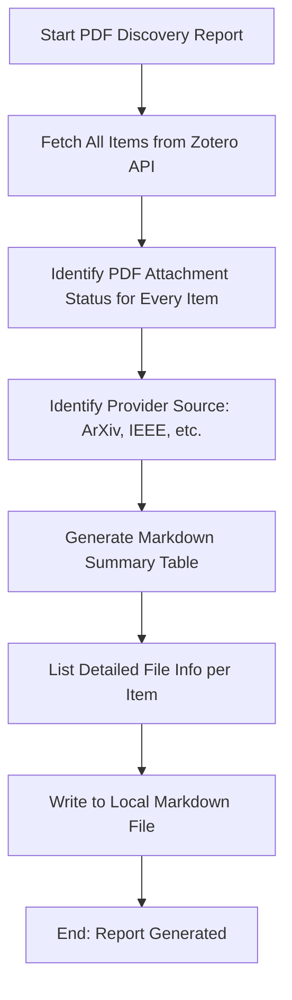

# DOC-SPEC: report pdf

## 1. Classification
- **Level:** 🟢 READ-ONLY (Discovery Reporting)
- **Target Audience:** Researcher / Librarian

## 2. Logic Flow (Visual Synthesis)

## 3. Synopsis
Generates a detailed "Discovery Report" in Markdown that catalogs the availability and provenance of PDF attachments across your entire library.

## 4. Description (Instructional Architecture)
The `report pdf` command is a specialized auditing tool for managing the "Physical Layer" of your research library. While other report commands focus on metadata or screening decisions, this command is dedicated to the physical files themselves. 

It provides a comprehensive list of all items, indicating whether a PDF is attached, where it was sourced from (if known), and its file size. This is particularly useful for identifying which parts of your library are "offline-ready" and which papers still require manual or automated retrieval. The output is a structured Markdown file that can be easily converted to PDF for archival purposes.

## 5. Parameter Matrix
| Flag | Type | Description | Ergonomic Note |
| :--- | :--- | :--- | :--- |
| `--output` | Path | File path where the Markdown report will be saved. | Required. Use `.md` extension. |

## 6. Scenario-Based Examples (Cognitive Anchors)
### Scenario: Auditing storage usage before a cleanup
**Problem:** My Zotero storage is almost full and I want to know which folders or providers are contributing most to the disk usage.
**Action:** `zotero-cli report pdf --output "library_file_audit.md"`
**Result:** A Markdown file is generated that lists every item and the size of its associated PDF, helping me identify large files or redundant content.

## 7. Cognitive Safeguards
- **Common Failure Modes:** Attempting to run without an active internet connection (metadata must be fetched from the API). 
- **Safety Tips:** Use this report in conjunction with `collection pdf strip` to surgically clean up folders that are consuming too much storage space.
