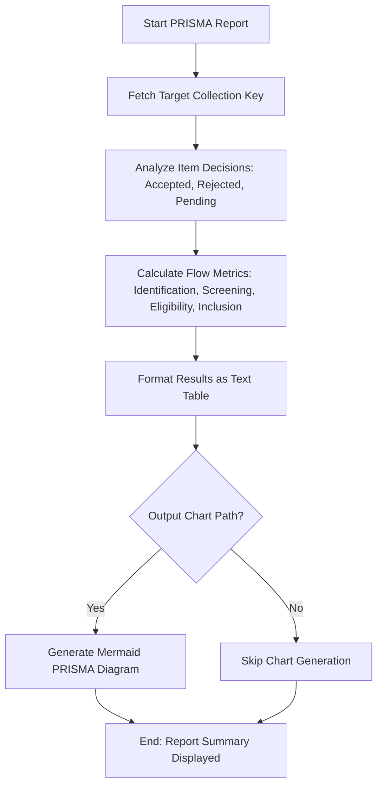

# DOC-SPEC: report prisma

## 1. Classification
- **Level:** 🟢 READ-ONLY (Scientific Reporting)
- **Target Audience:** Researcher / SLR Lead

## 2. Logic Flow (Visual Synthesis)

## 3. Synopsis
Generates quantitative data and visual flowcharts following the PRISMA (Preferred Reporting Items for Systematic Reviews and Meta-Analyses) standard for a specific collection.

## 4. Description (Instructional Architecture)
The `report prisma` command is a high-level auditing tool for Systematic Literature Reviews. It automatically calculates the flow of items through your screening phases based on the metadata recorded via `slr decide` or the `slr screen` TUI. 

The command identifies the number of items at each stage of the review (Identification, Screening, Eligibility, and Inclusion) and outputs a detailed summary table. If an `--output-chart` path is provided, it also generates a Mermaid-compatible diagram that can be rendered into a professional PRISMA Flow Diagram for inclusion in academic publications.

## 5. Parameter Matrix
| Flag | Type | Description | Ergonomic Note |
| :--- | :--- | :--- | :--- |
| `--collection` | String | Name or unique identifier (Key) of the collection. | Required. |
| `--output-chart`| Path | File path to save the generated Mermaid chart (e.g., `flow.mmd`). | Optional. |
| `--verbose` | Flag | Displays detailed audit logs for every item calculation. | Optional. |

## 6. Scenario-Based Examples (Cognitive Anchors)
### Scenario: Preparing the methodology section of a paper
**Problem:** I need to report exactly how many papers were screened and why they were excluded for my SLR.
**Action:** `zotero-cli report prisma --collection "SLR_MASTER" --output-chart "prisma_flow.mmd"`
**Result:** The terminal shows the counts for each phase, and `prisma_flow.mmd` is created with the visual flowchart data.

## 7. Cognitive Safeguards
- **Common Failure Modes:** Attempting to generate a report for a collection that has not yet undergone a screening process (no decisions recorded). 
- **Safety Tips:** Ensure that exclusion criteria are consistently applied across items to get accurate "Reason for Exclusion" breakdowns in the report.
