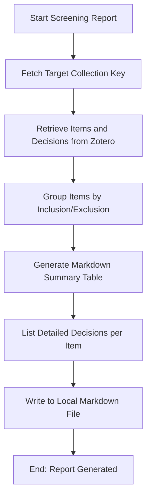

# DOC-SPEC: report screening

## 1. Classification
- **Level:** 🟢 READ-ONLY (Human-Readable Audit)
- **Target Audience:** Researcher / Author

## 2. Logic Flow (Visual Synthesis)

## 3. Synopsis
Generates a human-readable Markdown report summarizing the results of a screening phase, including inclusion/exclusion counts and detailed notes for each item.

## 4. Description (Instructional Architecture)
The `report screening` command transforms raw library data into a structured narrative. While `report prisma` provides quantitative metrics and `report snapshot` provides machine-readable data, `report screening` is designed for human consumption. 

It generates a Markdown document that includes a "Phase Summary" (number of papers accepted, rejected, or pending) followed by a detailed list of every item in the collection. For each item, it displays the final decision, the exclusion criteria used (if applicable), and any comments recorded by the reviewer. This report is perfect for inclusion in research logs or for sharing with supervisors to discuss specific edge cases.

## 5. Parameter Matrix
| Flag | Type | Description | Ergonomic Note |
| :--- | :--- | :--- | :--- |
| `--collection` | String | Name or unique identifier (Key) of the collection. | Required. |
| `--output` | Path | File path where the Markdown report will be saved. | Required. Use `.md` extension. |

## 6. Scenario-Based Examples (Cognitive Anchors)
### Scenario: Reviewing screening decisions with a colleague
**Problem:** I've finished screening 100 abstracts and I want a document that lists all the ones I rejected and why, so I can review them with my co-author.
**Action:** `zotero-cli report screening --collection "PHASE_1_SEARCH" --output "screening_results_v1.md"`
**Result:** A Markdown file is created with a clean table of all decisions and detailed notes for the rejected items.

## 7. Cognitive Safeguards
- **Common Failure Modes:** Attempting to generate a report for a collection where no items have been assigned a decision. The report will be generated but will contain empty tables. 
- **Safety Tips:** Use this report as a "Living Document" throughout your SLR to maintain clarity on your reasoning for including or excluding specific papers.
