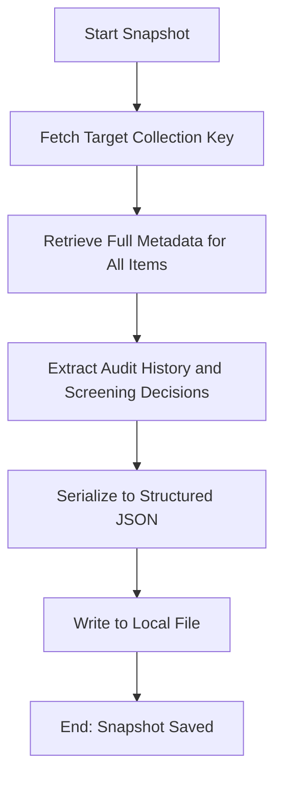

# DOC-SPEC: report snapshot

## 1. Classification
- **Level:** 🟢 READ-ONLY (Audit Trail)
- **Target Audience:** Auditor / SLR Lead

## 2. Logic Flow (Visual Synthesis)

## 3. Synopsis
Generates a comprehensive, machine-readable JSON snapshot of all items in a collection, including their full metadata and associated screening decisions (the "Audit Trail").

## 4. Description (Instructional Architecture)
The `report snapshot` command is the primary tool for "Scientific Reproducibility" within the `zotero-cli`. It captures the exact state of a research collection at a specific point in time. 

Unlike standard exports, the snapshot includes the `extra` field data where screening decisions (Accepted/Rejected), reviewer personas, and timestamps are stored. This creates a verifiable audit trail that can be used to justify inclusion/exclusion decisions during a peer review or to reconstruct the research process later. The resulting JSON file is ideal for long-term archival or for programmatic analysis using external data science tools.

## 5. Parameter Matrix
| Flag | Type | Description | Ergonomic Note |
| :--- | :--- | :--- | :--- |
| `--collection` | String | Name or unique identifier (Key) of the collection. | Required. |
| `--output` | Path | File path where the JSON snapshot will be saved. | Required. |

## 6. Scenario-Based Examples (Cognitive Anchors)
### Scenario: Archiving the audit trail for a publication
**Problem:** I'm submitting my paper and I need a machine-readable record of every decision made during the screening phase for the "Supplementary Materials."
**Action:** `zotero-cli report snapshot --collection "SLR_2024" --output "screening_audit_v1.json"`
**Result:** A JSON file is generated containing all metadata and the history of decisions for every paper in the collection.

## 7. Cognitive Safeguards
- **Common Failure Modes:** Attempting to save the snapshot to a directory without write permissions. 
- **Safety Tips:** Run this command at the end of each major SLR phase (e.g., after Title/Abstract screening and again after Full-Text screening) to maintain a versioned history of your progress.
