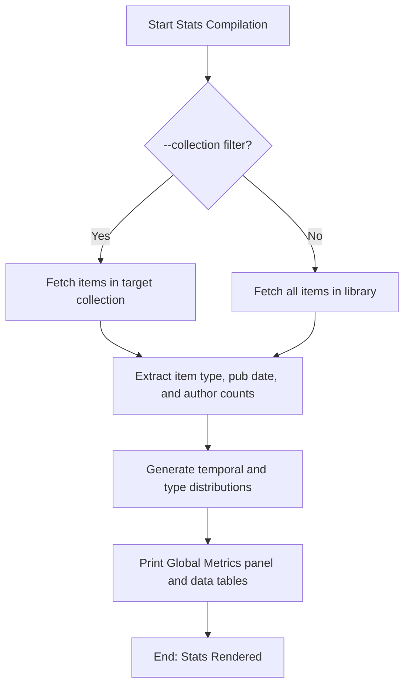

# DOC-SPEC: report stats

## 1. Classification
- **Level:** 🟢 READ-ONLY (Library Metrics Summary)
- **Target Audience:** Researchers / Librarians

## 2. Logic Flow (Visual Synthesis)

## 3. Synopsis
Gathers and displays global statistics about your Zotero library, including item types, total counts, and publication year distributions.

## 4. Description (Instructional Architecture)
The `report stats` command provides a high-level overview of a collection or library. It groups items by document type (journal article, thesis, conference paper, book) and lists counts and percentages. It also aggregates the temporal distribution by publication year.

## 5. Parameter Matrix
| Flag / Parameter | Type | Description | Ergonomic Note |
| :--- | :--- | :--- | :--- |
| `--collection` | String | Filter statistics to a specific collection instead of the entire library | Optional. |

## 6. Scenario-Based Examples (Cognitive Anchors)
### Scenario: Getting publication statistics for a systematic review
**Problem:** I need to report the distribution of publication types in my final collection.
**Action:** `zotero-cli report stats --collection "Included Papers"`
**Result:** Tables detailing the count and percentages of journal articles versus conference proceedings are displayed.

## 7. Cognitive Safeguards
- **Common Failure Modes:** Attempting to query stats on an empty collection.
- **Safety Tips:** Run this command on your complete library to find gaps in publication years or types.
