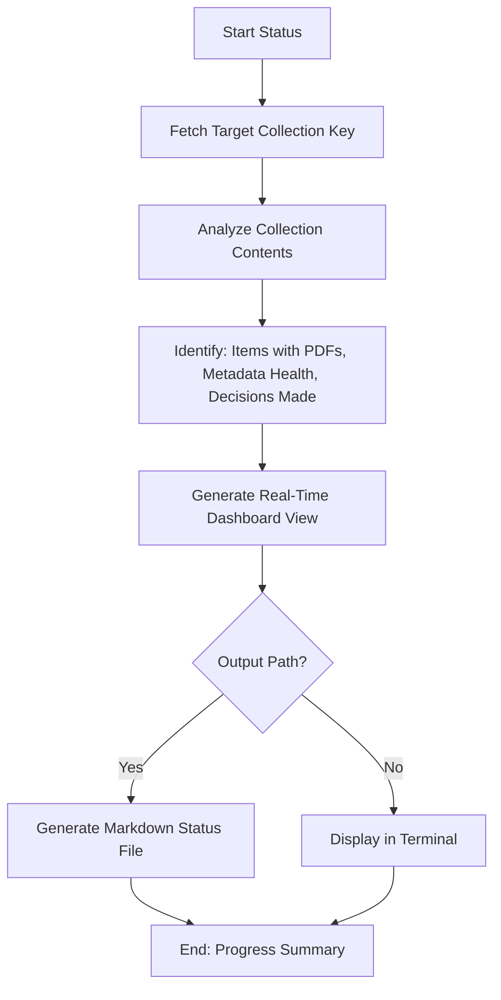

# DOC-SPEC: report status

## 1. Classification
- **Level:** 🟢 READ-ONLY (Progress Monitoring)
- **Target Audience:** Researcher / SLR Lead

## 2. Logic Flow (Visual Synthesis)

## 3. Synopsis
Displays a real-time dashboard of your collection's health and progress, highlighting the number of items with attachments, metadata completeness, and screening status.

## 4. Description (Instructional Architecture)
The `report status` command is the "Command Center" for your research collection. It provides a high-level overview of everything you need to know about the current state of your folder. 

It specifically reports on:
- **Total Items:** How many papers are in the collection.
- **PDF Coverage:** How many items have physical file attachments (crucial for RAG and reading).
- **Metadata Health:** Identifies items missing critical fields like DOI or Year.
- **Screening Progress:** Shows the percentage of items that have already been assigned a decision.

This command is ideal for daily monitoring of large-scale review projects to identify bottlenecks (e.g., "We have 50 items missing PDFs that need fetching").

## 5. Parameter Matrix
| Flag | Type | Description | Ergonomic Note |
| :--- | :--- | :--- | :--- |
| `--collection` | String | Name or unique identifier (Key) of the collection. | Required. |
| `--output` | Path | Optional file path to save the status report. | If provided, behaves like `report screening`. |

## 6. Scenario-Based Examples (Cognitive Anchors)
### Scenario: Checking if a collection is ready for reading
**Problem:** I've imported 500 papers and run a bulk PDF fetch. I want to know if every item now has its PDF before I disconnect for a flight.
**Action:** `zotero-cli report status --collection "TRAVEL_READING"`
**Result:** The CLI shows that 495 items have PDFs and 5 are still missing, allowing me to target those 5 specifically.

## 7. Cognitive Safeguards
- **Common Failure Modes:** Attempting to run on a collection that is completely empty. 
- **Safety Tips:** Use this command frequently during the "Preparation" phase of your research to ensure your data is healthy before starting the time-consuming screening or analysis phases.
