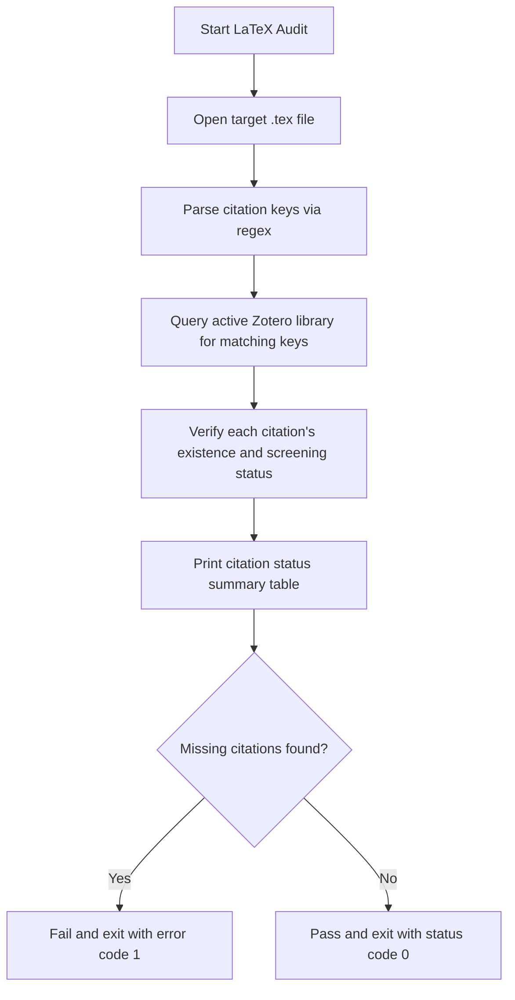

# DOC-SPEC: report verify-latex

## 1. Classification
- **Level:** 🟢 READ-ONLY (LaTeX Citation Check)
- **Target Audience:** Authors / Researchers

## 2. Logic Flow (Visual Synthesis)

## 3. Synopsis
Scans a LaTeX document for citations and verifies whether they exist in your active Zotero library and are screened.

## 4. Description (Instructional Architecture)
The `report verify-latex` command is a publishing safeguard. It reads your LaTeX manuscript, extracts all cited item keys (e.g. `\cite{ABCD1234}`), and queries Zotero to verify that every citation is present and has gone through the formal screening decision process. If any citation is missing or unscreened, the command fails.

## 5. Parameter Matrix
| Flag / Parameter | Type | Description | Ergonomic Note |
| :--- | :--- | :--- | :--- |
| `--latex` | String | Path to the main LaTeX file to audit | Required. |

## 6. Scenario-Based Examples (Cognitive Anchors)
### Scenario: Auditing a manuscript before submission
**Problem:** I want to make sure I haven't cited any papers that are missing from Zotero.
**Action:** `zotero-cli report verify-latex --latex "manuscript.tex"`
**Result:** The command validates all keys and exits cleanly if correct.

## 7. Cognitive Safeguards
- **Common Failure Modes:** Providing a bad path to the `.tex` file or running it on a file with no citations.
- **Safety Tips:** Run this check in your CI/CD pipeline or build script to prevent publication gaps.
