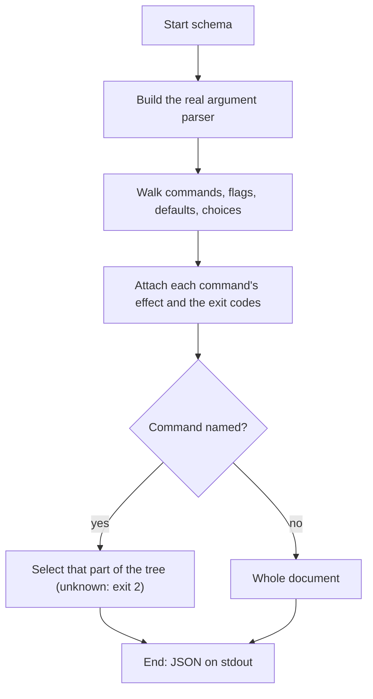

# DOC-SPEC: schema

## 1. Classification
- **Level:** 🟢 READ-ONLY (Introspection)
- **Target Audience:** Script author / AI agent

## 2. Logic Flow (Visual Synthesis)

## 3. Synopsis
Prints a machine-readable description of every command, flag and exit code as JSON.

## 4. Description (Instructional Architecture)
`schema` is for programs that drive zotero-cli: instead of scraping `--help`, they read one JSON document generated from the real argument parser. Besides what argparse knows (flags, types, defaults, choices, which options repeat), each runnable command carries an `effect`, `read`, `local` or `write`, and `preview_by_default` for write commands that only show what they would do until `--execute`, so an agent can tell which commands are safe to run freely.

## 5. Parameter Matrix
| Flag / Parameter | Type | Description | Ergonomic Note |
| :--- | :--- | :--- | :--- |
| `command_path` | String(s) | Shown as `COMMAND`: limit the output to this command or group, e.g. `item list` | Optional, positional. Unknown names exit 2. |

## 6. Scenario-Based Examples (Cognitive Anchors)
### Scenario: An agent learns what it can run
**Problem:** A script needs the exact flags of every command without parsing help text.
**Action:** `zotero-cli schema`
**Result:** One JSON document: version, exit codes, global options and the command tree.

### Scenario: Which commands can change my library?
**Problem:** I want an agent to run only commands that don't write to Zotero.
**Action:** `zotero-cli schema | jq '[.. | objects | select(.effect == "write") | .path | join(" ")]'`
**Result:** The list of `write` commands; the rest are `read` or `local`.

## 7. Cognitive Safeguards
- **Common Failure Modes:** Naming a command that doesn't exist (exit 2); the list of valid names is in the full output.
- **Safety Tips:** `effect` describes what a command *can* change, not what a particular invocation will: a `write` command with `preview_by_default` changes nothing until you pass `--execute`.
