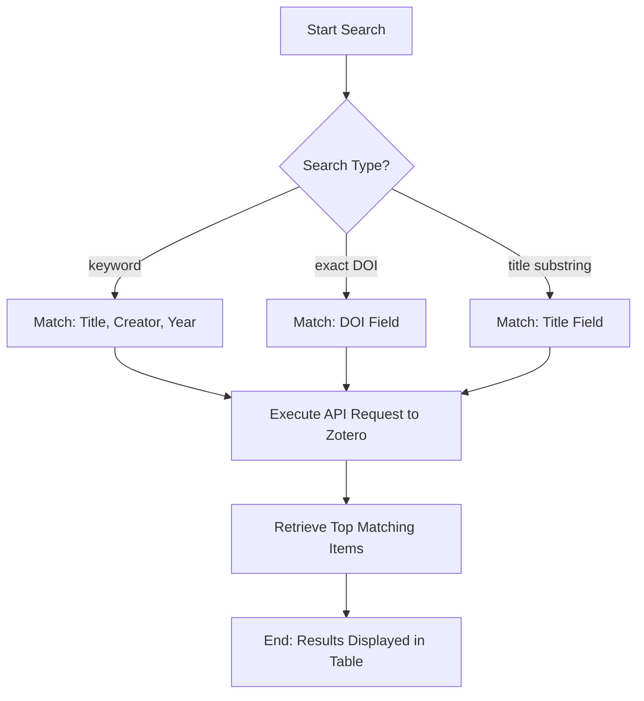

# DOC-SPEC: search

## 1. Classification
- **Level:** 🟢 READ-ONLY (Library Discovery)
- **Target Audience:** Researcher / Author

## 2. Logic Flow (Visual Synthesis)

## 3. Synopsis
Performs a fast, targeted search across your Zotero library to find items matching specific keywords, titles, or persistent identifiers like DOIs.

## 4. Description (Instructional Architecture)
The `search` command is the primary discovery tool for your personal or group library. It acts as a terminal-based interface to the Zotero database, allowing you to quickly locate items without opening the desktop client. 

You can perform a generic "Keyword" search which matches against the item's title, creators (authors), and publication year. For more precise results, the command provides specific flags for exact DOI matching and title substring filtering. Results are presented in a formatted table, including the unique `Item Key` which is required for subsequent operations like `item inspect` or `item move`.

## 5. Parameter Matrix
| Flag | Type | Description | Ergonomic Note |
| :--- | :--- | :--- | :--- |
| `query` | String | Keyword search term (Title, Creator, Year). | Positional argument. |
| `--doi` | String | Search for a specific Digital Object Identifier. | Useful for exact matches. |
| `--title`| String | Search for a specific substring within item titles. | Targeted discovery. |
| `--limit`| Integer| Maximum number of search results to display. | Default: 50. |

## 6. Scenario-Based Examples (Cognitive Anchors)
### Scenario: Finding a paper's key for inspection
**Problem:** I know I have a paper about "Transformer" architectures by "Vaswani" but I don't remember its key.
**Action:** `zotero-cli search "Vaswani Transformer"`
**Result:** The CLI displays all matching papers, and I can see the key `ABCD1234` for the specific paper I need.

## 7. Cognitive Safeguards
- **Common Failure Modes:** Attempting to search for common terms (e.g., "AI") without a `--limit` in a very large library, which may result in excessive API requests or long processing times. 
- **Safety Tips:** Use quotes for multi-word queries to ensure the shell handles the string correctly. Search is case-insensitive.
