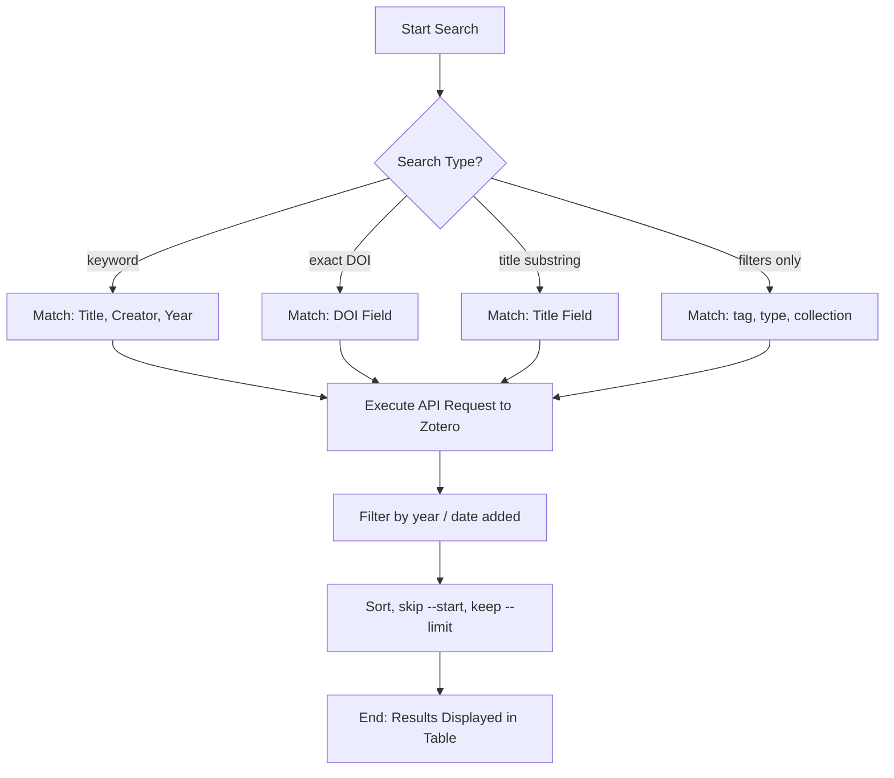

# DOC-SPEC: search

## 1. Classification
- **Level:** 🟢 READ-ONLY (Library Discovery)
- **Target Audience:** Researcher / Author

## 2. Logic Flow (Visual Synthesis)

```mermaid
graph TD
    A["Start Search"] --> B{"Search Type?"}
    B -- "keyword" --> C["Match: Title, Creator, Year"]
    B -- "exact DOI" --> D["Match: DOI Field"]
    B -- "title substring" --> E["Match: Title Field"]
    B -- "filters only" --> I["Match: tag, type, collection"]
    C --> F["Execute API Request to Zotero"]
    D --> F
    E --> F
    I --> F
    F --> J["Filter by year / date added"]
    J --> G["Sort, skip --start, keep --limit"]
    G --> H["End: Results Displayed in Table"]
```

## 3. Synopsis
Performs a fast, targeted search across your Zotero library to find items matching specific keywords, titles, or persistent identifiers like DOIs.

## 4. Description (Instructional Architecture)
The `search` command is the primary discovery tool for your personal or group library. It acts as a terminal-based interface to the Zotero database, allowing you to quickly locate items without opening the desktop client. 

You can perform a generic "Keyword" search which matches against the item's title, creators (authors), and publication year. For more precise results, the command provides specific flags for exact DOI matching and title substring filtering. Results are presented in a formatted table, including the unique `Item Key` which is required for subsequent operations like `item inspect` or `item move`.

## 5. Parameter Matrix
| Flag / Parameter | Type | Description | Ergonomic Note |
| :--- | :--- | :--- | :--- |
| `--doi` | String | Search by exact DOI | Optional. |
| `--limit` | Integer | Limit results (default: 50) | Optional. Default: 50. |
| `--format` | String | Output format: `table`, `json`, `csv` or `ndjson` (key, title, authors, year, doi; untruncated, stdout carries only the data). `ndjson` is one JSON object per line, written as each result arrives | Optional. Default: table. |
| `--title` | String | Search by title substring | Optional. |
| `--start` | Integer | Skip this many results first (paging) | Optional. Default: 0. Combine with `--limit` to page. |
| `--tag` | String | Only items with this tag. Repeat to require several; `a \|\| b` means either, a leading `-` excludes (write `--tag=-name`) | Optional, repeatable. |
| `--type` | String | Only this item type, e.g. `journalArticle`, `book`, `note` (`a \|\| b` for either) | Optional. |
| `--collection` | String | Only items filed in this collection (name or key) | Optional. An unknown name is an error; a name matching several collections is refused. |
| `--year` | String | Publication year or range: `2020`, `2018-2022`, `2018-` or `-2022` | Optional. Items with no year are left out. |
| `--added-since` | String | Only items added on or after `YYYY-MM-DD` | Optional. |
| `--added-until` | String | Only items added on or before `YYYY-MM-DD` | Optional. |
| `--sort` | String | `date`, `dateAdded`, `dateModified`, `title`, `creator` or `itemType` | Optional. Default: date. Items without the field come last. |
| `--direction` | String | `asc` or `desc` | Optional. Default: desc. |
| `query` | String | Keyword search (matches title, creator, or year) | Optional. |

## 6. Scenario-Based Examples (Cognitive Anchors)
### Scenario: Finding a paper's key for inspection
**Problem:** I know I have a paper about "Transformer" architectures by "Vaswani" but I don't remember its key.
**Action:** `zotero-cli search "Vaswani Transformer"`
**Result:** The CLI displays all matching papers, and I can see the key `ABCD1234` for the specific paper I need.

### Scenario: Everything tagged and recent, for a script
**Problem:** I want the keys of journal articles I tagged `to-read` and `ml` that I added this year, newest first.
**Action:** `zotero-cli search --tag to-read --tag ml --type journalArticle --added-since 2026-01-01 --sort dateAdded --format json`
**Result:** A JSON list on stdout. Filters need no keyword; the two `--tag`s must both match.

## 7. Cognitive Safeguards
- **Common Failure Modes:** Attempting to search for common terms (e.g., "AI") without a `--limit` in a very large library, which may result in excessive API requests or long processing times. 
- **Not supported:** running a saved search. The Zotero Web API exposes the definitions of saved searches but not their results, so `search` can't run one; use the filters above instead.
- **Safety Tips:** Use quotes for multi-word queries to ensure the shell handles the string correctly. Search is case-insensitive.
