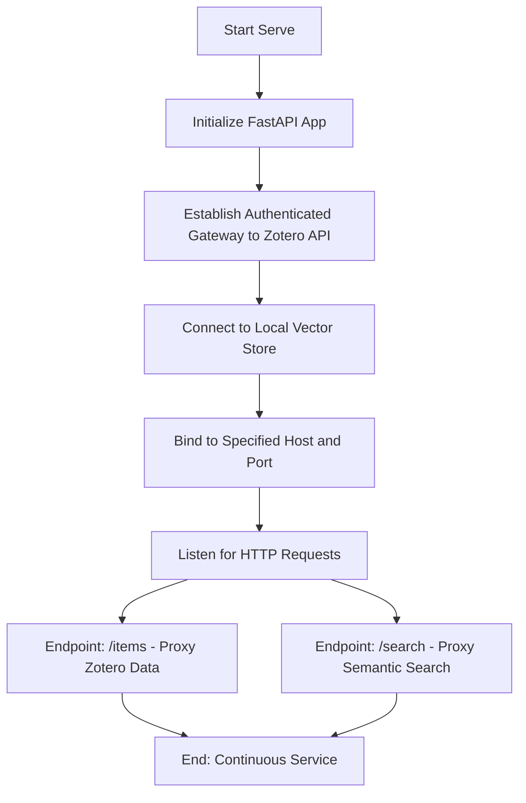

# DOC-SPEC: serve

## 1. Classification
- **Level:** 🟢 READ-ONLY (API Access)
- **Target Audience:** Developer / AI Engineer

## 2. Logic Flow (Visual Synthesis)

## 3. Synopsis
Starts a local HTTP API server that exposes your Zotero library and semantic search capabilities via standard REST endpoints for use by external applications or AI agents.

## 4. Description (Instructional Architecture)
The `serve` command transforms the `zotero-cli` from a terminal utility into a backend service. It launches a high-performance FastAPI server that provides a programmatic interface to your research data. 

This command is the "Integration Hub" for AI-powered research assistants. It exposes endpoints that allow other tools to query your library, retrieve item metadata, and perform semantic searches against your vector store (if populated). This is essential for building custom web dashboards, connecting your library to Large Language Models (LLMs), or integrating Zotero data into complex automated research pipelines.

## 5. Parameter Matrix
| Flag | Type | Description | Ergonomic Note |
| :--- | :--- | :--- | :--- |
| `--host` | String | The IP address to bind the server to. | Default: `127.0.0.1` (Localhost). |
| `--port` | Integer| The port number to listen on. | Default: `1969`. |
| `--reload` | Flag | Enables auto-reload when source code changes. | Useful for developers. |

## 6. Scenario-Based Examples (Cognitive Anchors)
### Scenario: Connecting Zotero to a custom research dashboard
**Problem:** I'm building a web app to track my research progress and I need a way to fetch item data from Zotero via JavaScript.
**Action:** `zotero-cli serve --host 0.0.0.0 --port 8000`
**Result:** The API is now reachable at `http://localhost:8000`, providing JSON responses for my library queries.

## 7. Cognitive Safeguards
- **Common Failure Modes:** Attempting to bind to a port that is already in use by another application. Bind errors will be displayed in the terminal. 
- **Safety Tips:** By default, the server is only accessible from your local machine. If binding to `0.0.0.0` (public access), ensure your network is secure as the API exposes your personal research metadata.
