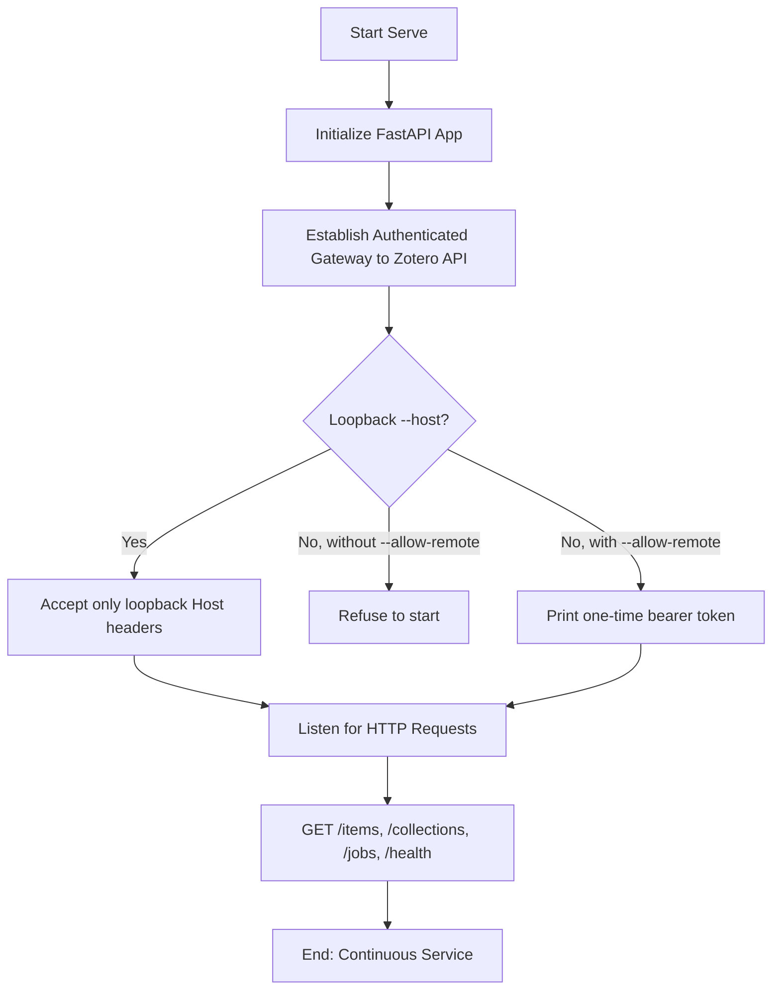

# DOC-SPEC: serve

## 1. Classification
- **Level:** 🟢 READ-ONLY (API Access)
- **Target Audience:** Developer / AI Engineer

## 2. Logic Flow (Visual Synthesis)

```mermaid
graph TD
    A["Start Serve"] --> B["Initialize FastAPI App"]
    B --> C["Establish Authenticated Gateway to Zotero API"]
    C --> D{"Loopback --host?"}
    D -->|Yes| E["Accept only loopback Host headers"]
    D -->|No, without --allow-remote| X["Refuse to start"]
    D -->|No, with --allow-remote| T["Print one-time bearer token"]
    E --> F["Listen for HTTP Requests"]
    T --> F
    F --> G["GET /items, /collections, /jobs, /health"]
    G --> I["End: Continuous Service"]
```

## 3. Synopsis
Starts a local, read-only HTTP API server that exposes your Zotero library through REST endpoints, for local scripts, dashboards or AI agents.

## 4. Description (Instructional Architecture)
The `serve` command transforms the `zotero-cli` from a terminal utility into a backend service. It launches a high-performance FastAPI server that provides a programmatic interface to your research data. 

It exposes read-only endpoints for items (`/items`, `/items/{key}`), collections (`/collections`), background jobs (`/jobs`) and health (`/health`), so other tools on your machine can query the library without shelling out to the CLI.

**Access control:** the API has no user accounts, so by default it only listens on `127.0.0.1` and only answers requests whose `Host` header is `127.0.0.1`, `localhost` or `::1`. Checking the Host header stops a web page you visit from reaching the API through DNS rebinding. To reach it from another machine, bind a non-loopback `--host` together with `--allow-remote`: the server then prints a random bearer token at startup, and every request must send `Authorization: Bearer <token>`.

## 5. Parameter Matrix
| Flag / Parameter | Type | Description | Ergonomic Note |
| :--- | :--- | :--- | :--- |
| `--host` | String | Bind host (Default: 127.0.0.1) | Optional. Default: 127.0.0.1. |
| `--port` | Integer | Bind port (Default: 1969) | Optional. Default: 1969. |
| `--reload` | Boolean | Enable auto-reload (Dev mode) | Optional. Default: False. |
| `--allow-remote` | Boolean | Allow a non-loopback `--host`; requests then need the printed bearer token | Optional. Without it, a non-loopback `--host` is refused. |
| `--allowed-host` | String (repeatable) | Extra Host header value to accept, e.g. a local hostname | Optional. |

## 6. Scenario-Based Examples (Cognitive Anchors)
### Scenario: Connecting Zotero to a custom research dashboard
**Problem:** I'm building a web app to track my research progress and I need a way to fetch item data from Zotero via JavaScript.
**Action:** `zotero-cli serve --port 8000`
**Result:** The API is reachable at `http://127.0.0.1:8000` from this machine only, returning JSON for library queries.

### Scenario: Reaching the API from another machine
**Problem:** My dashboard runs on another computer on my home network.
**Action:** `zotero-cli serve --host 0.0.0.0 --allow-remote`
**Result:** The server prints an access token once; the dashboard sends `Authorization: Bearer <token>` with every request. The token changes each time the server starts.

## 7. Cognitive Safeguards
- **Common Failure Modes:** Attempting to bind to a port that is already in use by another application. Bind errors will be displayed in the terminal. 
- **Safety Tips:** By default, the server is only reachable from your own machine. `--allow-remote` protects requests with a token, but the traffic is plain HTTP, so only use it on a network you trust. Requests with an unexpected `Host` header get `400 Invalid host header`; add names you use with `--allowed-host`.
- **Scope:** One `serve` process targets exactly one Zotero library - whichever `--config`/`--user`/`system switch` resolves at process startup. It is not multi-tenant: there is no per-request library selection. For HTTP access to more than one library, run a separate `serve` instance per library on a different port.
