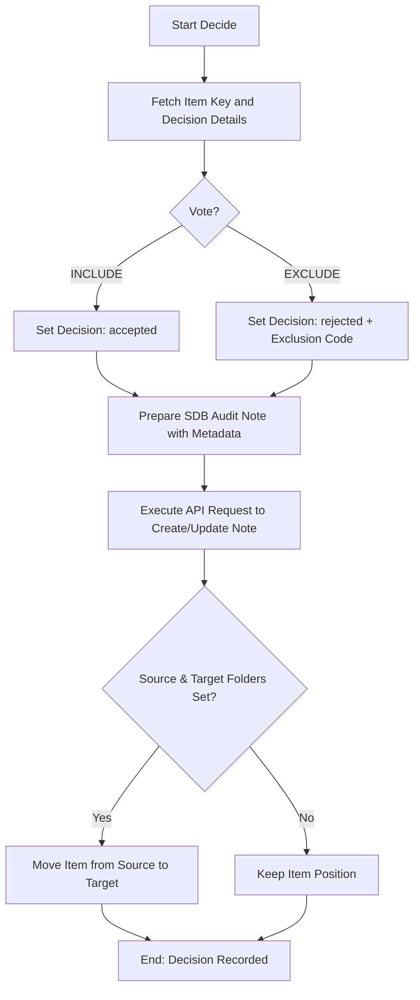

# DOC-SPEC: slr decide

## 1. Classification
- **Level:** 🟡 MODIFICATION (Single Item Audit)
- **Target Audience:** Researcher / Auditor

## 2. Logic Flow (Visual Synthesis)

## 3. Synopsis
Records a formal screening decision (Include/Exclude) for a single research item, ensuring a traceable audit trail by updating the item's internal Screening Database (SDB) notes.

## 4. Description (Instructional Architecture)
The `slr decide` command is the "Surgical Audit" tool for Systematic Literature Reviews. It allows you to record inclusion or exclusion results for individual items without entering the full `slr screen` TUI. 

This command is essential for maintaining scientific rigor. It not only records the binary decision but also captures the **Reviewer Persona**, the **Review Phase** (e.g., Title/Abstract, Full-Text), and the specific **Exclusion Code** or rationale. This metadata is stored as a persistent child note on the Zotero item, creating an immutable history of why every paper was chosen or rejected. 

## 5. Parameter Matrix
| Flag / Parameter | Type | Description | Ergonomic Note |
| :--- | :--- | :--- | :--- |
| `--agent-led` | Boolean | Run in Agent-led mode | Optional. Default: False. |
| `--code` | String | Reason code (required for EXCLUDE) | Optional. |
| `--evidence` | String | Evidence text for decision | Optional. |
| `--is-survey` | String | Exclusion code for surveys/SLRs | Optional. |
| `--key` | String | Item Key | Required. |
| `--no-pdf` | String | Exclusion code for missing PDFs | Optional. |
| `--not-english` | String | Exclusion code for non-English papers | Optional. |
| `--persona` | String | Reviewer persona | Optional. |
| `--phase` | String | Review phase | Optional. Default: title_abstract. |
| `--reason` | String | Detailed reason text | Optional. |
| `--short-paper` | String | Exclusion code for short papers | Optional. |
| `--source` | String | Source collection | Optional. |
| `--target` | String | Target collection | Optional. |
| `--vote` | String | Screening decision | Optional. |

## 6. Scenario-Based Examples (Cognitive Anchors)
### Scenario: Excluding a survey paper during review
**Problem:** I've identified that the paper with key `ABCD1234` is a survey, which violates my inclusion criteria (Code: `E2`).
**Action:** `zotero-cli slr decide --key "ABCD1234" --vote "EXCLUDE" --code "E2" --reason "Item is a survey paper"`
**Result:** The paper is marked as rejected in its internal audit note, citing criterion `E2`.

## 7. Cognitive Safeguards
- **Common Failure Modes:** Attempting to run `EXCLUDE` without providing a `--code`. The command will fail to ensure that no rejected paper lacks a justification. 
- **Safety Tips:** Use short, consistent codes (like `E1`, `E2`) for exclusion criteria to facilitate easier PRISMA reporting later via `report prisma`.
