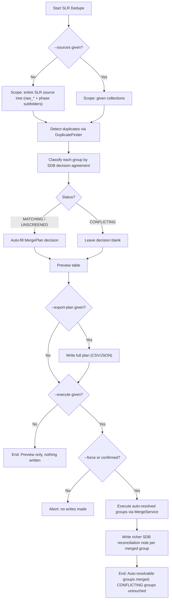

# DOC-SPEC: slr dedupe

## 1. Classification
- **Level:** 🔴 DESTRUCTIVE (Read-only preview by default; `--execute` permanently deletes duplicate items)
- **Target Audience:** SLR Leads / Reviewers

## 2. Logic Flow (Visual Synthesis)

## 3. Synopsis
Detects duplicate items across the SLR source tree (or a given set of collections), classifies each duplicate group by whether existing SDB screening decisions agree, and auto-merges the safe cases - leaving genuinely conflicting groups for manual review.

## 4. Description (Instructional Architecture)
A rigorous SLR can't just auto-merge every detected duplicate: the same paper can arrive as separate Zotero items from separate sources and get screened independently before anyone notices they're duplicates, producing genuinely conflicting recorded decisions (e.g. included via one source, excluded via another). Silently merging those would destroy or paper over audit history that Kitchenham/PRISMA rigor requires preserving.

`slr dedupe` reuses `report duplicates`'s detection (no forked matching logic) scoped to the SLR source tree by default, then classifies each group: `MATCHING` (all occurrences' SDB decisions agree), `UNSCREENED` (none screened yet), or `CONFLICTING` (decisions disagree). MATCHING/UNSCREENED groups get an auto-filled merge decision - safe to consolidate automatically. CONFLICTING groups are left undecided; the exported plan file itself becomes the reconciliation surface for a human or Corbenic-SLR to resolve, the same way `report duplicates --export-plan` works.

Physical consolidation is delegated entirely to the generic `item merge`/`MergeService.execute_plan` primitive (Issues #155/#156) - this command adds no duplicated merge logic. On a real, successful merge, it additionally writes a richer SDB reconciliation note per folded duplicate via `SLROrchestrator`, capturing every occurrence's own prior SDB decisions and source collection - preserving full history rather than collapsing it into a flat "merged" outcome.

Without `--execute`, only a preview is shown (and `--export-plan`, if given, still writes the file) - nothing is merged. With `--execute`, only the auto-resolvable (MATCHING/UNSCREENED) groups are merged; CONFLICTING groups are always left untouched by this command, regardless of `--execute`.

## 5. Parameter Matrix
| Flag / Parameter | Type | Description | Ergonomic Note |
| :--- | :--- | :--- | :--- |
| `--sources` | String | Comma-separated collection names or keys to scope detection to | Optional - omit to scan the entire SLR source tree (every `raw_*` collection and its phase subfolders). |
| `--export-plan` | String | Optional path to export the full reconciliation plan (`.csv` or `.json`) | Includes blank CONFLICTING rows for manual resolution via `item merge --from-plan`. |
| `--execute` | Boolean | Merge the auto-resolved (MATCHING/UNSCREENED) groups | Optional. Default: False (preview only). CONFLICTING groups are never auto-merged. |
| `--force` | Boolean | Skip the interactive confirmation prompt | Optional. Default: False. Still requires `--execute`. |

## 6. Scenario-Based Examples (Cognitive Anchors)
### Scenario: Reviewing SLR-wide duplicates before merging anything
**Problem:** I want to see how many duplicate groups exist across my whole SLR tree, and which are safe to auto-merge.
**Action:** `zotero-cli slr dedupe`
**Result:** A table lists every duplicate group with its SDB status; MATCHING/UNSCREENED groups are marked auto-resolvable, CONFLICTING groups are flagged for manual review. Nothing is written.

### Scenario: Auto-merging the safe duplicates, SLR-wide
**Problem:** I've reviewed the preview and want to consolidate the MATCHING/UNSCREENED groups now.
**Action:** `zotero-cli slr dedupe --execute`
**Result:** MATCHING/UNSCREENED groups are merged (tags/collections unioned, notes/attachments moved, duplicates permanently deleted) with a richer SDB reconciliation note recording each folded occurrence's prior screening decisions. CONFLICTING groups are left untouched.

### Scenario: Resolving conflicting groups by hand
**Problem:** Some duplicate groups have genuinely conflicting screening decisions across sources and need a human call.
**Action:** `zotero-cli slr dedupe --export-plan slr_dedupe_plan.csv`
**Result:** A CSV is written with one row per occurrence; MATCHING/UNSCREENED rows already have role/reason filled in, CONFLICTING rows are blank. Fill those in, then run `zotero-cli item merge --from-plan slr_dedupe_plan.csv --execute`.

## 7. Cognitive Safeguards
- **Common Failure Modes:** Expecting `--execute` to also resolve CONFLICTING groups - it never does, by design; those require an explicit human/Corbenic-SLR decision via the exported plan.
- **Safety Tips:** This is PERMANENT for whatever it merges - the Zotero Web API only supports hard delete. Always run without `--execute` first to preview. Genuinely conflicting screening decisions are exactly the case this command refuses to auto-resolve, since guessing wrong here would corrupt SLR audit history.
