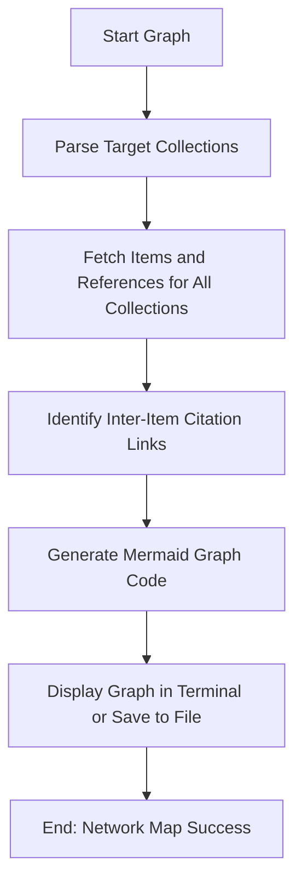

# DOC-SPEC: slr graph

## 1. Classification
- **Level:** 🟢 READ-ONLY (Visualization)
- **Target Audience:** Researcher / Author

## 2. Logic Flow (Visual Synthesis)

## 3. Synopsis
Generates a visual citation graph (network map) representing the relationships between papers across one or more collections.

## 4. Description (Instructional Architecture)
The `slr graph` command provides a visual "Landscape View" of your research data. Instead of looking at papers as a list, this command allows you to see how they are connected through citations and references. 

It analyzes the items within the specified collections and builds a network map using Mermaid syntax. This is particularly valuable for identifying "Hub Papers" (heavily cited works) or discovering "Islands" of research that are disconnected from the main discourse. The generated graph code can be copied into Markdown documents or rendered using visualization tools to create professional citation network diagrams for publications.

## 5. Parameter Matrix
| Flag | Type | Description | Ergonomic Note |
| :--- | :--- | :--- | :--- |
| `--collections` | String | Comma-separated list of collection names or keys. | Required. |

## 6. Scenario-Based Examples (Cognitive Anchors)
### Scenario: Visualizing the structure of a research field
**Problem:** I have two folders, "Transformers" and "CNNs," and I want to see how much these two fields cite each other in my collection.
**Action:** `zotero-cli slr graph --collections "TRANS_01,CNN_01"`
**Result:** The CLI outputs Mermaid code that, when rendered, shows a network of nodes (papers) and edges (citations) connecting the two folders.

## 7. Cognitive Safeguards
- **Common Failure Modes:** Attempting to graph very large collections (>200 items) which can lead to a "Spaghetti Graph" that is difficult to read. 
- **Safety Tips:** Use this command on smaller, curated "Selection" folders rather than raw "Search Result" folders to maintain visual clarity.
