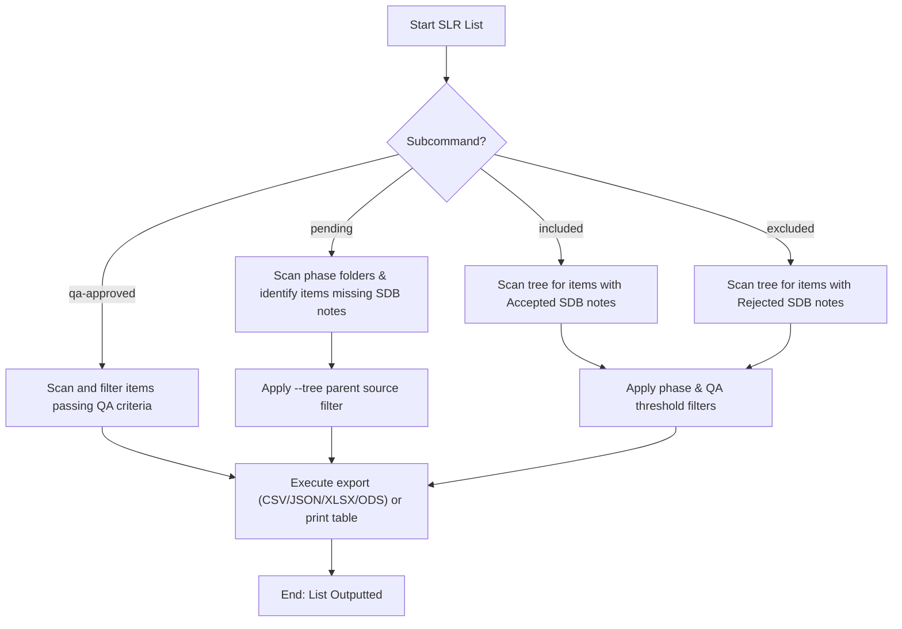

# DOC-SPEC: slr list

## 1. Classification
- **Level:** 🟢 READ-ONLY (Funnel Discovery)
- **Target Audience:** Researchers / SLR Leads

## 2. Logic Flow (Visual Synthesis)

## 3. Synopsis
Lists items in the systematic literature review funnel based on status (pending, included, excluded, qa-approved) and phase.

## 4. Description (Instructional Architecture)
The `slr list` subcommands inventory papers during the screening process:
- **`pending`**: Finds items stuck in the review queue that have not received an audit note for their current phase.
- **`included` / `excluded`**: Lists papers that have been formally accepted or rejected, with filters for Title/Abstract (`--ta`), Full Text (`--ft`), or Quality Assessment (`--qa`) phases.
- **`qa-approved`**: Lists all papers that cleared Quality Assessment, supporting bulk export to CSV, JSON, XLSX, and ODS formats.

## 5. Parameter Matrix
| Flag / Parameter | Type | Description | Ergonomic Note |
| :--- | :--- | :--- | :--- |
| `--csv` | String | Export to CSV file | Optional. |
| `--fullscreen, --ft` | Boolean | Filter for Full Text phase | Optional. Default: False. |
| `--json` | String | Export to JSON file | Optional. |
| `--ods` | String | Export to ODS file | Optional. |
| `--qa` | Float | Filter for Quality Assessment phase (optional threshold) | Optional. |
| `--ta` | Boolean | Filter for Title & Abstract phase | Optional. Default: False. |
| `--tree` | String | Filter by root collection name or key | Optional. |
| `--xlsx` | String | Export to XLSX file | Optional. |

## 6. Scenario-Based Examples (Cognitive Anchors)
### Scenario: Listing ACM papers accepted during Abstract review
**Problem:** I want to see a list of ACM papers accepted at Title/Abstract screening.
**Action:** `zotero-cli slr list included --tree "raw_acm" --ta`
**Result:** The CLI groups and prints the accepted items with their keys and titles.

## 7. Cognitive Safeguards
- **Common Failure Modes:** Attempting to run Excel/Calc exports (`--xlsx` or `--ods`) without required local Python libraries (`openpyxl` or `odfpy`).
- **Safety Tips:** Check `slr report status` first for high-level statistics before listing items.
