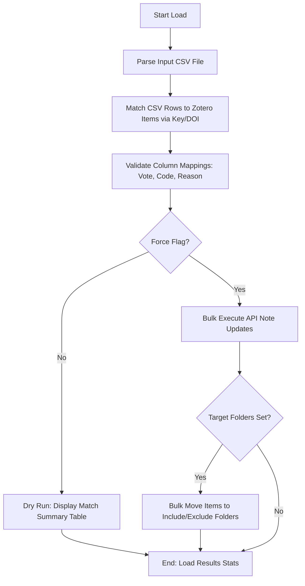

# DOC-SPEC: slr load

## 1. Classification
- **Level:** 🟡 MODIFICATION (Bulk Audit Update)
- **Target Audience:** Researcher / SLR Lead

## 2. Logic Flow (Visual Synthesis)

## 3. Synopsis
Bulk-imports screening decisions from an external CSV file (e.g., from Rayyan or Excel) into your Zotero library, updating internal audit notes and optionally triaging items into folders.

## 4. Description (Instructional Architecture)
The `slr load` command is the "Integration Bridge" for large-scale review projects. It is common to perform initial screening in dedicated tools like Rayyan or even in shared spreadsheets. This command allows you to bring those external decisions back into Zotero to maintain a centralized, authoritative research database. 

It uses a flexible matching logic that attempts to link CSV rows to Zotero items using the unique `Key` or the `DOI`. You can customize the column mappings to match your specific CSV header names. By default, the command runs in **Dry Run** mode, showing you exactly which items were matched and what decisions will be recorded. The `--force` flag is required to actually commit these changes to Zotero.

## 5. Parameter Matrix
| Flag / Parameter | Type | Description | Ergonomic Note |
| :--- | :--- | :--- | :--- |
| `--col-code` | String | CSV column mapping for Exclusion Code (Default: 'Code'). | Optional. |
| `--col-doi` | String | CSV column mapping for DOI (Default: 'DOI'). Used for matching if Key is missing. | Optional. |
| `--col-evidence` | String | CSV column mapping for Evidence or snippets (Default: 'Evidence'). | Optional. |
| `--col-key` | String | CSV column mapping for Zotero Key (Default: 'Key'). | Optional. |
| `--col-reason` | String | CSV column mapping for the Reason for decision (Default: 'Reason'). | Optional. |
| `--col-title` | String | CSV column mapping for Item Title (Default: 'Title'). Used as a secondary anchor. | Optional. |
| `--col-vote` | String | CSV column mapping for Decision/Vote (Default: 'Vote'). Expected: INCLUDE/EXCLUDE. | Optional. |
| `--file` | String | Path to the input CSV file. Must contain a 'Key' or 'DOI' column. | Required. |
| `--force` | Boolean | Apply changes to the Zotero library. Omit for a non-destructive dry-run. | Optional. Default: False. |
| `--move-to-excluded` | String | Target collection for items with an 'EXCLUDE' or 'REJECTED' decision. | Optional. |
| `--move-to-included` | String | Target collection for items with an 'INCLUDE' or 'ACCEPTED' decision. | Optional. |
| `--phase` | String | Review phase identifier (e.g., 'title_abstract', 'full_text'). | Optional. Default: title_abstract. |
| `--reviewer` | String | Reviewer persona/name (e.g., 'Chicout') for audit tracking. | Required. |

## 6. Scenario-Based Examples (Cognitive Anchors)
### Scenario: Importing Rayyan screening results
**Problem:** I've finished a collaborative screening in Rayyan and I want the results reflected in my Zotero "Primary Review" folder.
**Action:** `zotero-cli slr load --file "rayyan_results.csv" --reviewer "Team_A" --force --move-to-included "ACCEPTED"`
**Result:** 500 items are matched, their audit notes updated, and accepted items are moved to the `ACCEPTED` folder.

## 7. Cognitive Safeguards
- **Common Failure Modes:** CSV column headers that don't match the command's defaults. Always use the `--col-*` flags if your CSV uses different names (e.g., `--col-vote "Decision"`). 
- **Safety Tips:** ALWAYS run without `--force` first. Review the output table to ensure that items are being matched correctly (especially if relying on DOI matching).
