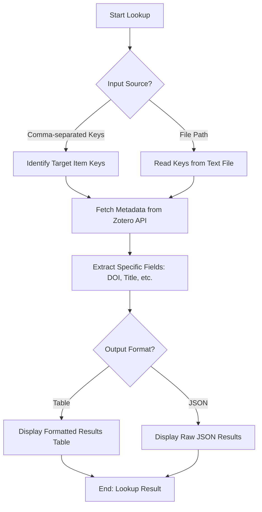

# DOC-SPEC: slr lookup

## 1. Classification
- **Level:** 🟢 READ-ONLY (Batch Metadata Retrieval)
- **Target Audience:** Researcher / Author

## 2. Logic Flow (Visual Synthesis)

## 3. Synopsis
Quickly retrieves specific metadata fields for a batch of Zotero items using their unique keys, outputting the results in a formatted table or JSON.

## 4. Description (Instructional Architecture)
The `slr lookup` command is a high-speed discovery tool designed for researchers who need to check the status of specific papers without opening the full Zotero client. It allows you to target precise metadata fields (like DOI, publication year, or citation key) for multiple items at once. 

This command is particularly useful for verifying identifiers before a submission or for preparing a quick summary of a subset of your library. You can provide item keys directly in the command line or read them from a text file, making it easy to integrate into larger automated scripts.

## 5. Parameter Matrix
| Flag | Type | Description | Ergonomic Note |
| :--- | :--- | :--- | :--- |
| `--keys` | String | Comma-separated list of Zotero Item Keys. | For quick manual checks. |
| `--file` | Path | Local path to a file containing a list of Keys. | For batch processing. |
| `--fields` | String | Comma-separated list of metadata fields to retrieve. | e.g., `DOI,title,date`. |
| `--format` | Choice | `table` or `json`. | Default: `table`. |

## 6. Scenario-Based Examples (Cognitive Anchors)
### Scenario: Verifying DOIs for a set of citations
**Problem:** I have 10 item keys and I want to quickly see their DOIs to make sure they are all present.
**Action:** `zotero-cli slr lookup --keys "ABCD1234,WXYZ5678" --fields "DOI,title"`
**Result:** The CLI displays a clean table with the title and DOI for each of the specified keys.

## 7. Cognitive Safeguards
- **Common Failure Modes:** Attempting to lookup keys that do not exist in the active library context. The command will return empty results for invalid keys. 
- **Safety Tips:** Use `--fields` to limit the output to only what you need, reducing terminal clutter when processing many items.
