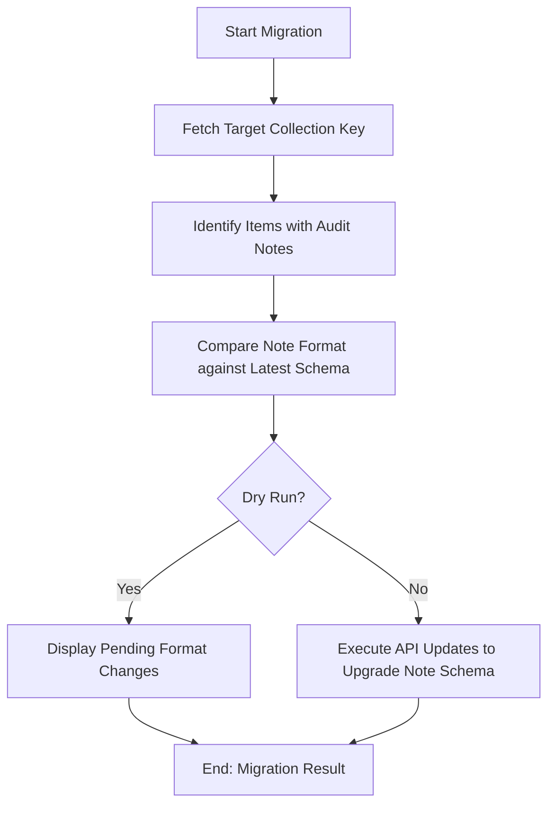

# DOC-SPEC: slr migrate

## 1. Classification
- **Level:** 🟡 MODIFICATION (Schema Upgrade)
- **Target Audience:** Researcher / Auditor

## 2. Logic Flow (Visual Synthesis)

## 3. Synopsis
Upgrades the internal format of screening/audit notes for all items in a collection to match the latest standards of the `zotero-cli`.

## 4. Description (Instructional Architecture)
The `slr migrate` command is a maintenance utility designed to ensure data longevity. As the `zotero-cli` evolves, the internal structure of how screening decisions are stored (in the `extra` field or child notes) may be improved for better reporting or machine readability. 

This command scans your library, identifies "Legacy" audit notes, and automatically reformats them into the "Canonical" structure required by newer reporting tools (like `report prisma`). It includes a `--dry-run` mode to safely preview which notes will be affected before making any changes to your Zotero cloud data.

## 5. Parameter Matrix
| Flag | Type | Description | Ergonomic Note |
| :--- | :--- | :--- | :--- |
| `--collection` | String | Name or unique identifier (Key) of the collection. | Required. |
| `--dry-run` | Flag | Displays the format changes without applying them. | Recommended for safety. |

## 6. Scenario-Based Examples (Cognitive Anchors)
### Scenario: Updating an old research project for a new report
**Problem:** I'm trying to run a PRISMA report on an SLR I started two years ago, but the command isn't recognizing my old decisions.
**Action:** `zotero-cli slr migrate --collection "OLD_SLR_FOLDER" --dry-run`
**Result:** The CLI shows that it can upgrade 100 legacy notes to the new format, which will enable the PRISMA report to function correctly.

## 7. Cognitive Safeguards
- **Common Failure Modes:** Attempting to migrate items that do not have any audit metadata at all. The command will simply skip these items. 
- **Safety Tips:** Always perform a `collection backup` before running a migration on a critical research collection. Schema changes are persistent once committed to the API.
