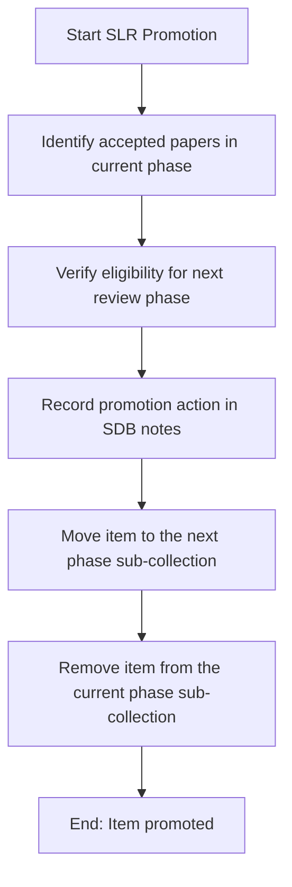

# DOC-SPEC: slr promote

## 1. Classification
- **Level:** 🟡 MODIFICATION (Funnel Promotion)
- **Target Audience:** Researchers / SLR Leads

## 2. Logic Flow (Visual Synthesis)

## 3. Synopsis
Promotes accepted papers from one systematic review phase to the next, updating their SDB status and displacing them to the correct target folder.

## 4. Description (Instructional Architecture)
The `slr promote` command automates phase transitions. When an item successfully clears one stage (e.g. Title & Abstract screening) and is approved for the next (e.g. Full Text review), this command updates the item's SDB status to reflect its new stage and moves it into the next phase sub-collection.

## 5. Parameter Matrix
| Flag / Parameter | Type | Description | Ergonomic Note |
| :--- | :--- | :--- | :--- |
| `--code` | String | Reason code (required for EXCLUDE) | Optional. |
| `--key` | String | Item Key (ZoteroID) | Required. |
| `--persona` | String | Researcher name (e.g. Paula) | Optional. Default: unknown. |
| `--phase` | String | SLR phase being voted on | Required. |
| `--reason` | String | Detailed reason text | Optional. |
| `--tree` | String | Root collection name or key (e.g. raw_acm) | Required. |
| `--vote` | String | Screening decision | Required. |

## 6. Scenario-Based Examples (Cognitive Anchors)
### Scenario: Promoting abstract-screened papers to full-text review
**Problem:** I want to advance all papers that passed Title/Abstract review into the Full Text phase.
**Action:** `zotero-cli slr promote`
**Result:** Eligible papers are moved from `01_title_abstract` into `02_full_text`.

## 7. Cognitive Safeguards
- **Common Failure Modes:** Attempting to promote items when the next phase directories are missing.
- **Safety Tips:** Always run `slr report status` to confirm screening is complete for a phase before promoting items.
