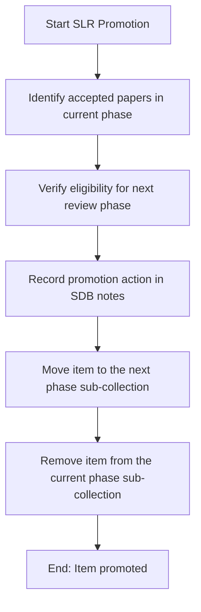

# DOC-SPEC: slr promote

## 1. Classification
- **Level:** 🟡 MODIFICATION (Funnel Promotion)
- **Target Audience:** Researchers / SLR Leads

## 2. Logic Flow (Visual Synthesis)

```mermaid
graph TD
    A["Start SLR Promotion"] --> B["Identify accepted papers in current phase"]
    B --> C["Verify eligibility for next review phase"]
    C --> D["Record promotion action in SDB notes"]
    D --> E["Move item to the next phase sub-collection"]
    E --> F["Remove item from the current phase sub-collection"]
    F --> G["End: Item promoted"]
```

## 3. Synopsis
Promotes accepted papers from one systematic review phase to the next, updating their SDB status and displacing them to the correct target folder.

## 4. Description (Instructional Architecture)
The `slr promote` command automates phase transitions. When an item successfully clears one stage (e.g. Title & Abstract screening) and is approved for the next (e.g. Full Text review), this command updates the item's SDB status to reflect its new stage and moves it into the next phase sub-collection.

## 5. Parameter Matrix
| Flag / Parameter | Type | Description | Ergonomic Note |
| :--- | :--- | :--- | :--- |
| `--code` | String | Reason code (required for EXCLUDE) | Optional. |
| `--key` | String | Item Key (ZoteroID) | Required. |
| `--persona` | String | Researcher name (e.g. Paula) | Optional. Default: unknown. |
| `--phase` | String | SLR phase being voted on | Required. |
| `--reason` | String | Detailed reason text | Optional. |
| `--tree` | String | Root collection name or key (e.g. raw_acm) | Required. |
| `--vote` | String | Screening decision | Required. |

## 6. Scenario-Based Examples (Cognitive Anchors)
### Scenario: Accepting a paper at title/abstract screening
**Problem:** Paper `ABCD1234` in the `raw_acm` source passed title/abstract review, and I want to record that and move it to the next phase in one step.
**Action:** `zotero-cli slr promote --key "ABCD1234" --vote INCLUDE --phase title_abstract --tree "raw_acm"`
**Result:** The decision is recorded as an SDB note, and the paper is moved into the next phase folder of the `raw_acm` tree. (`slr promote` works one paper at a time; `slr reconcile` realigns a whole tree.)

## 7. Cognitive Safeguards
- **Common Failure Modes:** Attempting to promote items when the next phase directories are missing.
- **Safety Tips:** Always run `slr report status` to confirm screening is complete for a phase before promoting items.
