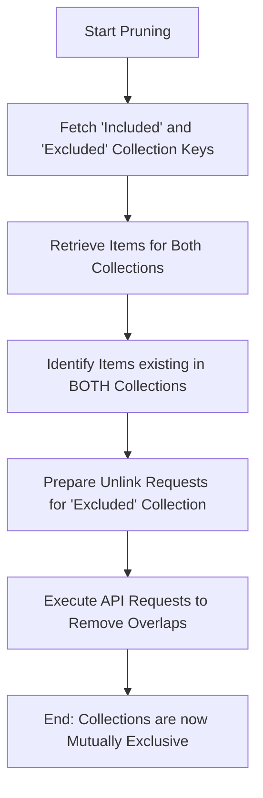

# DOC-SPEC: slr prune

## 1. Classification
- **Level:** 🔴 DESTRUCTIVE (Item-Collection Unlinking)
- **Target Audience:** Researcher / SLR Lead

## 2. Logic Flow (Visual Synthesis)

## 3. Synopsis
Ensures that two collections (typically your "Included" and "Excluded" sets) are mutually exclusive by removing any overlapping items from the specified excluded collection.

## 4. Description (Instructional Architecture)
The `slr prune` command is a "Data Hygiene" tool designed to fix errors in library organization. During rapid screening, it is common for a paper to be accidentally left in an "Excluded" folder after it has been promoted to "Included." This redundancy can skew scientific reports and PRISMA flowcharts. 

The command identifies items that are present in both the `--included` (winner) and `--excluded` (loser) collections and automatically removes the link to the excluded folder. It's important to note that the item itself is not deleted from Zotero; it is merely unlinked from the redundant folder to ensure your datasets are disjoint and ready for reporting.

## 5. Parameter Matrix
| Flag | Type | Description | Ergonomic Note |
| :--- | :--- | :--- | :--- |
| `--included` | String | Name or Key of the primary (winner) collection. | Required. |
| `--excluded` | String | Name or Key of the secondary (loser) collection. | Required. Items removed from here. |

## 6. Scenario-Based Examples (Cognitive Anchors)
### Scenario: Fixing overlapping folders before a PRISMA report
**Problem:** I've noticed that my "Rejected" folder still contains 5 papers that I decided to "Accept" later. My counts are incorrect.
**Action:** `zotero-cli slr prune --included "Accepted_Papers" --excluded "Rejected_Papers"`
**Result:** The 5 overlapping papers are removed from "Rejected_Papers," ensuring that each paper exists in only one of the two folders.

## 7. Cognitive Safeguards
- **Common Failure Modes:** Providing collection names that are shared by multiple folders in your library. For deterministic results, always use the unique `Collection Key`. 
- **Safety Tips:** Run `report status` on both folders before and after pruning to verify the exact number of items removed.
