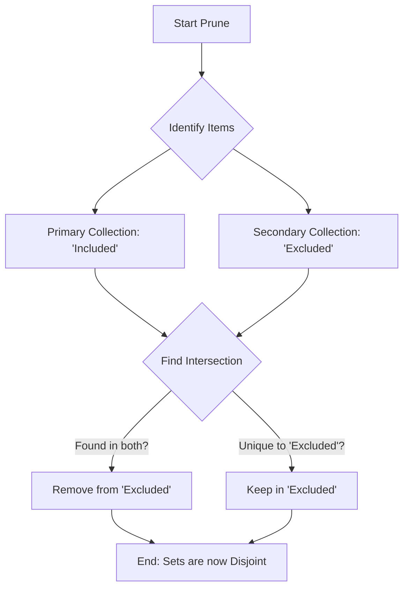

# DOC-SPEC: slr prune

## 1. Classification
- **Level:** 🔴 DESTRUCTIVE (Library Modification)
- **Target Audience:** SLR Lead / Auditor

## 2. Logic Flow (Visual Synthesis)

## 3. Synopsis
Enforces mutual exclusivity between two collections by removing items from the 'Excluded' collection that already exist in the 'Included' collection.

## 4. Description (Instructional Architecture)
In a Systematic Literature Review (SLR), items should not simultaneously reside in both the 'Included' and 'Excluded' collections. The `slr prune` command identifies this intersection and "prunes" (removes) the redundant items from the secondary collection (`--excluded`). 

This command is typically used after a screening phase to ensure the final datasets used for PRISMA reporting are strictly separated. It does **not** delete the items from your Zotero library entirely; it only unlinks them from the specified collection.

## 5. Parameter Matrix
| Flag | Type | Description | Ergonomic Note |
| :--- | :--- | :--- | :--- |
| `--included` | String | Name or Key of the "Master" collection. | Items here are NEVER removed. |
| `--excluded` | String | Name or Key of the collection to be cleaned. | Items found in both will be removed from here. |

## 6. Scenario-Based Examples (Cognitive Anchors)
### Scenario: Cleaning the Excluded set after Full Text Review
**Problem:** During the screening, some papers were accidentally left in the "Excluded" folder after being promoted to the "Included" folder. This is skewing my PRISMA statistics.
**Action:** `zotero-cli slr prune --included "Full Text Included" --excluded "Full Text Excluded"`
**Result:** Any paper found in both folders is removed from "Full Text Excluded," leaving the folders perfectly disjoint.

## 7. Cognitive Safeguards
- **Common Failure Modes:** Providing the wrong collection name. If the name is ambiguous (multiple collections with the same name), use the Zotero Collection Key instead.
- **Safety Tips:** Always run a `report status` or `report prisma` before and after pruning to verify the count changes as expected.
