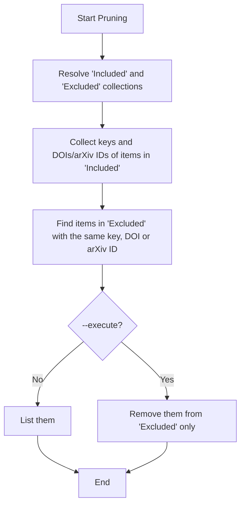

# DOC-SPEC: slr prune

## 1. Classification
- **Level:** 🟡 MODIFICATION (removes items from a collection; never deletes them). Previews by default; applies with `--execute`.
- **Target Audience:** Researcher / SLR Lead

## 2. Logic Flow (Visual Synthesis)

```mermaid
graph TD
    A["Start Pruning"] --> B["Resolve 'Included' and 'Excluded' collections"]
    B --> C["Collect keys and DOIs/arXiv IDs of items in 'Included'"]
    C --> D["Find items in 'Excluded' with the same key, DOI or arXiv ID"]
    D --> E{"--execute?"}
    E -- "No" --> F["List them"]
    E -- "Yes" --> G["Remove them from 'Excluded' only"]
    F --> H["End"]
    G --> H
```

## 3. Synopsis
Makes two collections disjoint for PRISMA reporting: every item in `--excluded` that is also in `--included` (the same item, or a duplicate import with the same DOI/arXiv ID) is removed from `--excluded`. Nothing is deleted from your library.

## 4. Description (Instructional Architecture)
During rapid screening a paper can stay in an "Excluded" folder after being promoted to "Included", which skews PRISMA counts. `slr prune` finds those overlaps: the same Zotero item in both folders, or a duplicate import that carries the same DOI or arXiv ID.

Without `--execute` it lists them. With `--execute` it removes them from the `--excluded` collection only. Items are never deleted. To merge duplicate imports into one item, use `item merge` or `slr dedupe`.

Collection names shared by several collections are refused; the error lists the candidate keys.

## 5. Parameter Matrix
| Flag / Parameter | Type | Description | Ergonomic Note |
| :--- | :--- | :--- | :--- |
| `--excluded` | String | Secondary collection (Loser/Excluded - items removed from here) | Required. |
| `--included` | String | Primary collection (Winner/Included) | Required. |
| `--execute` | Boolean | Apply the change (default: preview only) | Optional. Default: False. |

## 6. Scenario-Based Examples (Cognitive Anchors)
### Scenario: Fixing overlapping folders before a PRISMA report
**Problem:** My "Rejected" folder still contains 5 papers that I decided to accept later. My counts are wrong.
**Action:** `zotero-cli slr prune --included "Accepted_Papers" --excluded "Rejected_Papers"`, then add `--execute`
**Result:** The first run lists the 5 papers; the second removes them from "Rejected_Papers". They stay in the library and in "Accepted_Papers".

## 7. Cognitive Safeguards
- **Common Failure Modes:** Expecting duplicate imports to be merged: prune only takes them out of `--excluded`. Use `slr dedupe` to merge them.
- **Safety Tips:** Run `slr report status` before and after to check the counts.
