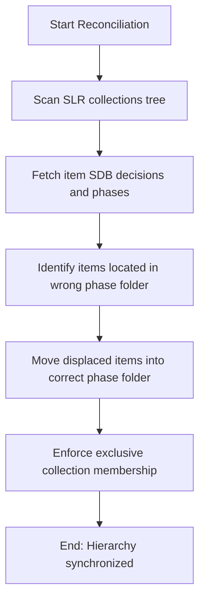

# DOC-SPEC: slr reconcile

## 1. Classification
- **Level:** 🟡 MODIFICATION (Hierarchy Reconciliation)
- **Target Audience:** SLR Leads / Researchers

## 2. Logic Flow (Visual Synthesis)

## 3. Synopsis
Synchronizes collection folder structures with SDB decision notes to ensure all items reside in their correct review phase folder.

## 4. Description (Instructional Architecture)
The `slr reconcile` command is a structural cleanup tool. Over the course of a systematic review, papers can become displaced or reside in incorrect collections relative to their recorded audit decisions (e.g. abstract accepted but still in `01_title_abstract`). This command scans the review hierarchy and automatically relocates items to match their recorded SDB phase and decision, keeping folders synchronized.

## 5. Parameter Matrix
| Flag / Parameter | Type | Description | Ergonomic Note |
| :--- | :--- | :--- | :--- |
| `--execute` | Boolean | Perform the actual displacement moves | Optional. Default: False. |
| `--qa-threshold` | Float | Minimum total score for QA success (default: 2.0) | Optional. Default: 2.0. |
| `--tree` | String | Root collection name or key (e.g. raw_acm) | Required. |
| `--verbose` | Boolean | Show detailed move logs | Optional. Default: False. |

## 6. Scenario-Based Examples (Cognitive Anchors)
### Scenario: Recovering folder alignment after manual changes
**Problem:** Reviewers manually dragged items in Zotero, causing discrepancies with recorded SDB notes.
**Action:** `zotero-cli slr reconcile`
**Result:** The CLI moves all mismatched papers to their correct phase collection.

## 7. Cognitive Safeguards
- **Common Failure Modes:** Attempting to reconcile a library where SDB notes are corrupt or missing.
- **Safety Tips:** Run `slr report status` to view overall pipeline completeness before performing reconciliation.
