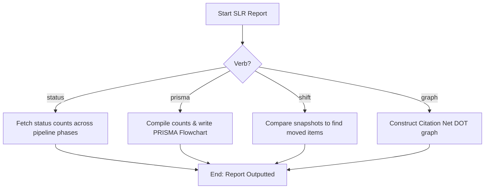

# DOC-SPEC: slr report

## 1. Classification
- **Level:** 🟢 READ-ONLY (Funnel Analytics & Visualization)
- **Target Audience:** Researchers / SLR Leads / Authors

## 2. Logic Flow (Visual Synthesis)

## 3. Synopsis
Aggregates, compiles, and visualizes SLR funnel metrics, screening snapshots, citation networks, consensus discrepancies, and rejection summaries.

## 4. Description (Instructional Architecture)
The `slr report` subcommands provide a detailed dashboard of your systematic literature review's execution.
- **`status`**: Shows progress bars and grids summarizing Title/Abstract, Full Text, and QA decisions.
- **`prisma`**: Builds standard PRISMA flow diagrams.
- **`shift`**: Traces version history changes across snapshots.
- **`graph`**: Generates citation networks.
- **`snapshot` / `screening`**: Freezes states or writes reports.
- **`exclusion-summary` / `consensus`**: Breaks down reasons or reviewer discrepancies.

## 5. Parameter Matrix
| Flag / Parameter | Type | Description | Ergonomic Note |
| :--- | :--- | :--- | :--- |
| `--all-sources` | Boolean | Display status for all raw search sources in the library | Optional. Default: False. |
| `--collection` | String | Collection name or key | Required. |
| `--collections` | String | Comma-separated collection names or keys | Required. |
| `--new` | String | Path to new Snapshot JSON file | Required. |
| `--old` | String | Path to old Snapshot JSON file | Required. |
| `--output` | String | Output Markdown path | Required. |
| `--output-chart` | String | Path to save flowchart image (uses mmdc) | Optional. |
| `--verbose` | Boolean | Verbose details | Optional. Default: False. |

## 6. Scenario-Based Examples (Cognitive Anchors)
### Scenario: Generating a PRISMA chart for a publication
**Problem:** I need to build a PRISMA flowchart file `prisma.png` from my "Screened Papers" collection.
**Action:** `zotero-cli slr report prisma --collection "Screened Papers" --output-chart "prisma.png"`
**Result:** The flowchart is rendered and saved to the designated path.

## 7. Cognitive Safeguards
- **Common Failure Modes:** Attempting to render a PRISMA chart when mermaid-cli (`mmdc`) is not installed.
- **Safety Tips:** Run `slr report status --all-sources` to verify your overall SLR health before exporting reports.
