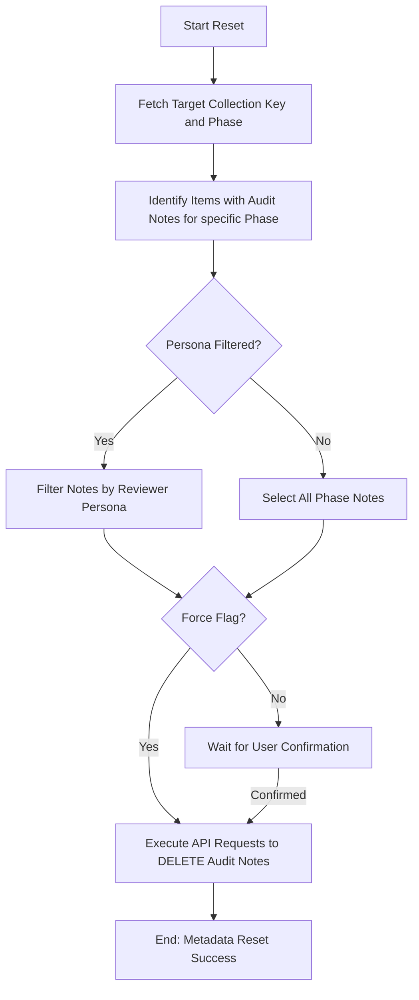

# DOC-SPEC: slr reset

## 1. Classification
- **Level:** 🔴 DESTRUCTIVE (Audit Metadata Deletion)
- **Target Audience:** Auditor / SLR Lead

## 2. Logic Flow (Visual Synthesis)

## 3. Synopsis
Permanently deletes screening decisions and audit metadata for items in a specific collection and review phase, effectively resetting that part of the review process.

## 4. Description (Instructional Architecture)
The `slr reset` command is the "Factory Reset" tool for your systematic review. It is used when a screening phase needs to be completely re-run due to changes in criteria, a new reviewer joining the project, or an error in the original process. 

This command identifies all internal child notes (the Screening Database) that match the specified `--phase` and (optionally) the `--persona`. It then permanently removes these records from the items via the Zotero API. Unlike `collection clean`, this command targets the **metadata** (decisions) rather than the items' collection membership. It is a high-risk operation and requires either an interactive confirmation or the `--force` flag.

## 5. Parameter Matrix
| Flag | Type | Description | Ergonomic Note |
| :--- | :--- | :--- | :--- |
| `--name` | String | Name or unique identifier (Key) of the collection. | Required. |
| `--phase` | String | The review phase to be wiped (e.g., `Title_Abstract`). | Required. |
| `--persona`| String | Limit the reset to decisions made by a specific reviewer. | Optional. |
| `--force` | Flag | Skips the interactive confirmation prompt. | Use with extreme caution. |

## 6. Scenario-Based Examples (Cognitive Anchors)
### Scenario: Re-running a screening phase after a criteria change
**Problem:** My team decided to change our inclusion criteria after I had already screened 50 papers in the "Title_Abstract" phase. I need to clear my decisions and start over.
**Action:** `zotero-cli slr reset --name "SLR_FOLDER" --phase "Title_Abstract" --persona "Chicout"`
**Result:** All decisions recorded by "Chicout" for that specific phase are deleted, allowing for a fresh screening session.

## 7. Cognitive Safeguards
- **Common Failure Modes:** Attempting to reset a phase that does not exist or providing the wrong persona name. The CLI will warn you if no matching records are found. 
- **Safety Tips:** ALWAYS perform a `report snapshot` before running a reset. Once the audit notes are deleted, the history of those decisions is permanently lost.
