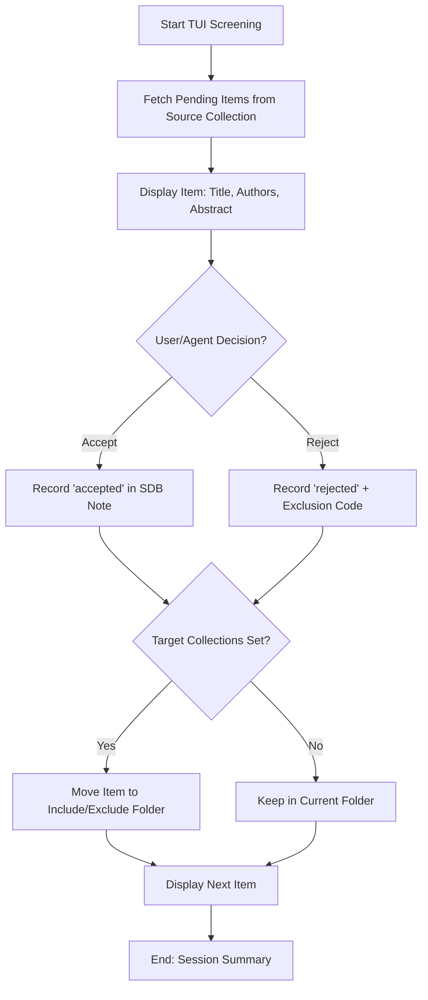

# DOC-SPEC: slr screen

## 1. Classification
- **Level:** 🟡 MODIFICATION (Interactive Triage)
- **Target Audience:** Researcher / SLR Lead

## 2. Logic Flow (Visual Synthesis)

## 3. Synopsis
Launches an interactive, text-based user interface (TUI) for rapid, high-volume screening of research papers within a Zotero collection.

## 4. Description (Instructional Architecture)
The `slr screen` command is the "Engine Room" of the Systematic Literature Review process. It is designed to maximize screening velocity by providing a distraction-free terminal interface where you can review titles and abstracts in sequence. 

As you make decisions (Accept/Reject), the CLI automatically:
1.  **Records the Audit Trail:** Creates/Updates a hidden "SDB Note" on the Zotero item containing the decision, reviewer persona, and timestamp.
2.  **Triages the Library:** Moves the item to your specified `--include` or `--exclude` collections, ensuring your Zotero library structure stays synchronized with your review progress.
The command also supports an `--agent` mode, enabling autonomous or semi-autonomous screening when combined with AI-led reviewer personas.

## 5. Parameter Matrix
| Flag | Type | Description | Ergonomic Note |
| :--- | :--- | :--- | :--- |
| `--source` | String | Name or Key of the collection to screen. | Required. |
| `--include`| String | Target collection for accepted items. | Optional but recommended. |
| `--exclude`| String | Target collection for rejected items. | Optional but recommended. |
| `--agent`  | Flag | Enables Agent-led screening logic. | For AI automation. |
| `--persona`| String | Reviewer name recorded in the audit trail. | Default: `Human`. |

## 6. Scenario-Based Examples (Cognitive Anchors)
### Scenario: Rapid abstract screening phase
**Problem:** I have 200 papers in my "Initial Search" folder (Key: `INIT_01`) and I need to review their abstracts quickly.
**Action:** `zotero-cli slr screen --source "INIT_01" --include "ACCEPTED_PAPERS" --exclude "REJECTED_PAPERS"`
**Result:** The TUI launches, displaying the first abstract. Pressing `a` accepts and moves the paper to `ACCEPTED_PAPERS`.

## 7. Cognitive Safeguards
- **Common Failure Modes:** Forgetting to specify `--include` or `--exclude`. The decisions are still recorded in Zotero notes, but the items won't be moved between folders. 
- **Safety Tips:** Use `collection list` to find your target folder keys before starting a long screening session. Decisions are synced in real-time to the Zotero API.
