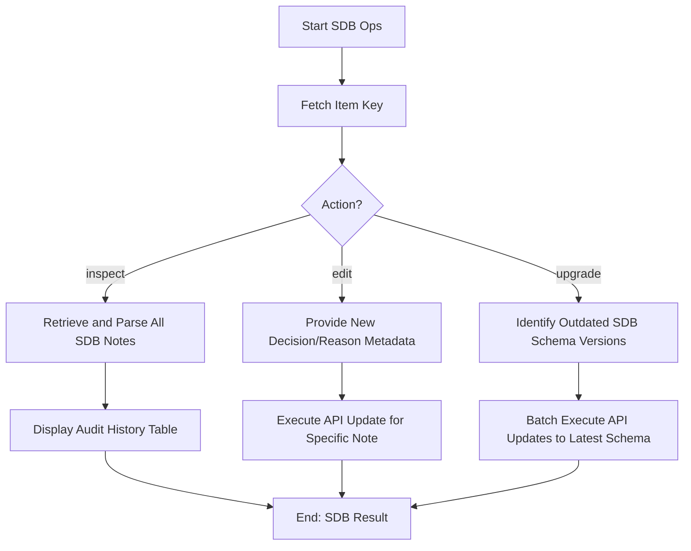

# DOC-SPEC: slr sdb

## 1. Classification
- **Level:** [🟢 READ-ONLY (Inspect) | 🟡 MODIFICATION (Edit/Upgrade)]
- **Target Audience:** Researcher / Auditor

## 2. Logic Flow (Visual Synthesis)

## 3. Synopsis
Manages the internal Screening Database (SDB) notes associated with Zotero items, allowing for inspection, modification, or schema migration of the audit trail.

## 4. Description (Instructional Architecture)
The `slr sdb` command is the "Database Administrator" for your review's audit trail. In `zotero-cli`, decisions are stored as specially formatted JSON notes attached to items. These notes form the Screening Database.

- **`inspect`**: Provides a clear view of every screening decision ever made for an item, including the phase, persona, and rationale. 
- **`edit`**: Allows you to correct a mistake in a previously recorded decision without having to re-run the entire screening TUI.
- **`upgrade`**: As the `zotero-cli` evolves, the format of these notes may change. This command ensures that your old research data is migrated to the newest reporting standards.

## 5. Parameter Matrix
| Command | Flag | Type | Description | Ergonomic Note |
| :--- | :--- | :--- | :--- | :--- |
| `inspect` | `--key` | String | Unique Zotero Item Key. | Required. |
| `edit` | `--key` | String | Unique Zotero Item Key. | Required. |
| `edit` | `--vote`| Choice | `INCLUDE` or `EXCLUDE`. | New decision. |
| `upgrade` | `--all` | Flag | Migrates the entire library. | Use with caution. |

## 6. Scenario-Based Examples (Cognitive Anchors)
### Scenario: Verifying the audit history of a controversial paper
**Problem:** I want to see how many different reviewers screened paper `ABCD1234` and what their final consensus was.
**Action:** `zotero-cli slr sdb inspect --key "ABCD1234"`
**Result:** The CLI displays a table showing every decision entry for that paper, timestamped and attributed to individual personas.

## 7. Cognitive Safeguards
- **Common Failure Modes:** Attempting to `edit` a note that doesn't exist. The CLI will warn you if no SDB entry is found for the specified key. 
- **Safety Tips:** Use `upgrade` before running major reports (like `report prisma`) if your research project spans multiple years or CLI versions to ensure data consistency.
