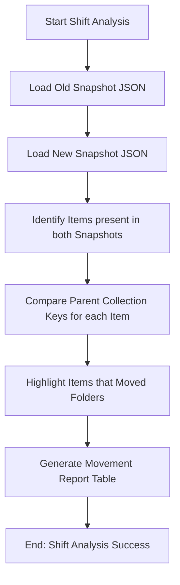

# DOC-SPEC: slr shift

## 1. Classification
- **Level:** 🟢 READ-ONLY (Change Analysis)
- **Target Audience:** Auditor / SLR Lead

## 2. Logic Flow (Visual Synthesis)

## 3. Synopsis
Compares two Zotero library snapshots to identify research items that have moved between collections, facilitating the tracking of review progress over time.

## 4. Description (Instructional Architecture)
The `slr shift` command is a "Temporal Audit" tool. In long-running Systematic Literature Reviews, items frequently move from "Identification" to "Screening" to "Inclusion" folders. Tracking these movements is essential for ensuring that no papers are lost during the triage process. 

The command takes two JSON snapshot files (generated via `report snapshot`) and performs a comparative analysis. It identifies items that exist in both snapshots but are linked to different parent collections. The output is a formatted table showing exactly which papers "shifted" from one folder to another, providing clear evidence of workflow progression.

## 5. Parameter Matrix
| Flag | Type | Description | Ergonomic Note |
| :--- | :--- | :--- | :--- |
| `--old` | Path | File path to the earlier JSON snapshot. | Required. |
| `--new` | Path | File path to the more recent JSON snapshot. | Required. |

## 6. Scenario-Based Examples (Cognitive Anchors)
### Scenario: Verifying papers moved during Title screening
**Problem:** I want to confirm that all papers I accepted yesterday have correctly moved from my "Unscreened" folder to "Accepted."
**Action:** `zotero-cli slr shift --old "yesterday.json" --new "today.json"`
**Result:** The CLI displays a list of papers that shifted their collection affiliation between the two snapshots.

## 7. Cognitive Safeguards
- **Common Failure Modes:** Attempting to compare snapshots that were taken from different libraries or using malformed JSON files. 
- **Safety Tips:** Use `report snapshot` regularly to maintain a versioned history of your library state, enabling you to run `slr shift` whenever you need to audit your workflow.
