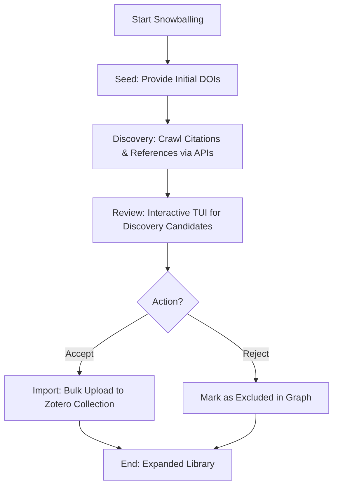

# DOC-SPEC: slr snowball

## 1. Classification
- **Level:** 🟡 MODIFICATION (Recursive Discovery)
- **Target Audience:** Researcher / SLR Lead

## 2. Logic Flow (Visual Synthesis)

## 3. Synopsis
Executes Forward and Backward Snowballing (citation tracking) to recursively discover new research papers based on a set of seed articles.

## 4. Description (Instructional Architecture)
The `slr snowball` command is the "Growth Engine" for literature reviews. It automates the tedious process of following reference lists (Backward Snowballing) and finding later papers that cite your current selection (Forward Snowballing). 

The process follows a structured lifecycle:
1.  **Seed**: You provide a set of "Golden Papers" via their DOIs.
2.  **Discovery**: Background workers crawl academic APIs (like Semantic Scholar or CrossRef) to find related papers.
3.  **Review**: An interactive TUI allows you to quickly screen these discovered candidates.
4.  **Import**: Successfully screened papers are automatically added to your Zotero library. 
This command ensures that your review is comprehensive and captures all relevant branches of a research topic.

## 5. Parameter Matrix
| Command | Flag | Type | Description | Ergonomic Note |
| :--- | :--- | :--- | :--- | :--- |
| `seed` | `--doi` | String | A starting DOI for discovery. | Can be called multiple times. |
| `discovery`| `--workers` | Integer | Number of concurrent API workers. | Optional. |
| `review` | `--phase` | String | Review phase identifier. | Interactive TUI. |
| `import` | `--collection` | String | Target Zotero collection Key. | For accepted candidates. |

## 6. Scenario-Based Examples (Cognitive Anchors)
### Scenario: Expanding a review from a single seminal paper
**Problem:** I've found one "perfect" paper and I want to find everything it cites and everything that has cited it since.
**Action:** `zotero-cli slr snowball seed --doi "10.1145/1234.567"` then `zotero-cli slr snowball discovery`.
**Result:** The CLI builds a graph of related papers, which I can then review via `slr snowball review`.

## 7. Cognitive Safeguards
- **Common Failure Modes:** Attempting discovery on papers without DOIs. Snowballing relies on persistent identifiers for citation tracking. 
- **Safety Tips:** Snowballing can quickly lead to "Context Explosion." Use the `review` TUI frequently to prune irrelevant branches before your discovery graph becomes too large.
