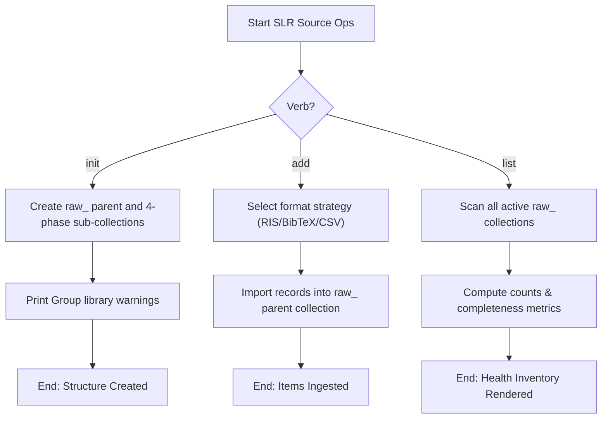

# DOC-SPEC: slr source

## 1. Classification
- **Level:** [🟡 MODIFICATION (Structure Ingestion) | 🟢 READ-ONLY (Inventory Lists)]
- **Target Audience:** Researchers / SLR Leads

## 2. Logic Flow (Visual Synthesis)

## 3. Synopsis
Manages collection infrastructure initialization, targeted search result imports, and active source pipelines inventories.

## 4. Description (Instructional Architecture)
The `slr source` subcommands manage search results ingestion:
- **`init`**: Automatically sets up the four phase folders (`01_title_abstract`, `02_full_text`, `03_quality_assessment`, `04_data_extraction`) inside a main `raw_` collection.
- **`add`**: Imports search result files (RIS/BibTeX/CSV) directly into the `raw_` collection, automatically identifying formats (IEEE, Springer, etc.).
- **`list`**: Reviews the health and completion metrics of all raw ingestion pipelines.

## 5. Parameter Matrix
| Flag / Parameter | Type | Description | Ergonomic Note |
| :--- | :--- | :--- | :--- |
| `--file` | String | Path to RIS, BibTeX, or CSV file to import | Required. |
| `--name` | String | Name or key of the raw collection (e.g. acm) | Required. |
| `--verbose` | Boolean | Print verbose details | Optional. Default: False. |

## 6. Scenario-Based Examples (Cognitive Anchors)
### Scenario: Initializing a new review pipeline for ACM papers
**Problem:** I need to prepare my Zotero collection hierarchy for upcoming ACM search result files.
**Action:** `zotero-cli slr source init --name "acm"`
**Result:** Creates `raw_acm` and its four nested phase directories.

## 7. Cognitive Safeguards
- **Common Failure Modes:** Attempting to `add` files into a collection name that does not exist or has not been initialized.
- **Safety Tips:** Always initialize your group library and target collection using `slr source init` before running `slr source add`.
