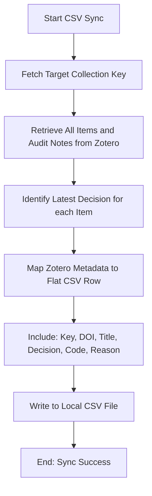

# DOC-SPEC: slr sync-csv

## 1. Classification
- **Level:** 🟢 READ-ONLY (Offline Synchronization)
- **Target Audience:** Researcher / Data Analyst

## 2. Logic Flow (Visual Synthesis)

## 3. Synopsis
Exports the current state of screening decisions from Zotero into a local CSV file, effectively creating an offline "mirror" of your research audit trail.

## 4. Description (Instructional Architecture)
The `slr sync-csv` command is the inverse of `slr load`. It allows you to take the decisions you've made within Zotero (via `slr screen` or `slr decide`) and extract them into a flat, readable CSV format. 

This is essential for researchers who need to perform data analysis in external tools (like R, Python, or Excel) or who want to maintain an offline, human-readable record of their screening progress. The command ensures that the latest decision metadata, including exclusion codes and reviewer rationale, is correctly captured for every item in the specified collection.

## 5. Parameter Matrix
| Flag | Type | Description | Ergonomic Note |
| :--- | :--- | :--- | :--- |
| `--collection` | String | Name or unique identifier (Key) of the collection. | Required. |
| `--output` | Path | File path where the synced CSV will be saved. | Required. |

## 6. Scenario-Based Examples (Cognitive Anchors)
### Scenario: Preparing data for statistical analysis
**Problem:** I've finished screening my papers in Zotero and I want to generate a spreadsheet showing the breakdown of exclusion reasons.
**Action:** `zotero-cli slr sync-csv --collection "SCREENING_PHASE_1" --output "screening_data.csv"`
**Result:** A CSV file is created that lists every paper and its corresponding decision metadata, ready for import into Excel or R.

## 7. Cognitive Safeguards
- **Common Failure Modes:** Attempting to sync to a file that is already open in another application (like Excel), which might prevent the CLI from writing the new data. 
- **Safety Tips:** Use this command as a "Backup" mechanism for your screening results. Having a local CSV record provides an extra layer of data safety beyond the Zotero cloud.
