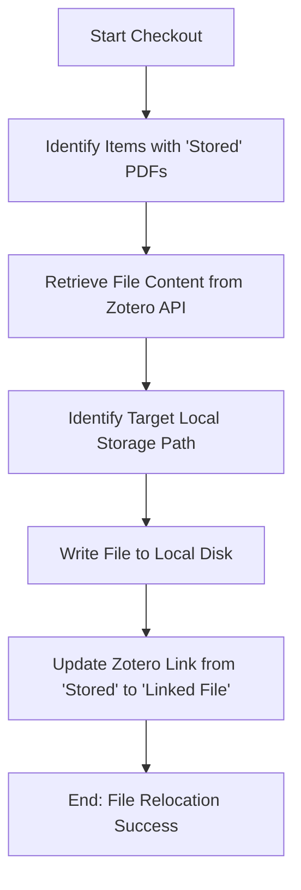

# DOC-SPEC: storage checkout

## 1. Classification
- **Level:** 🟡 MODIFICATION (File Relocation)
- **Target Audience:** SysAdmin / Advanced User

## 2. Logic Flow (Visual Synthesis)

## 3. Synopsis
Moves research files (PDFs) from Zotero's internal cloud storage to your local filesystem, transforming them into "Linked Files" to save cloud space.

## 4. Description (Instructional Architecture)
The `storage checkout` command is a specialized tool for managing Zotero storage quotas. By default, Zotero "stores" files in its own cloud, which has a limited free tier. This command automates the process of "checking out" those files: it downloads them to your pre-configured local storage directory and updates the Zotero metadata to point to the local path instead. 

This allows you to maintain a massive library of PDFs on your own hard drive (or a large external disk) while still having them perfectly indexed and searchable within Zotero. The command ensures that the link remains active, so opening the PDF from the Zotero desktop client will still work correctly.

## 5. Parameter Matrix
| Flag | Type | Description | Ergonomic Note |
| :--- | :--- | :--- | :--- |
| `--limit` | Integer | Maximum number of files to process in one run. | Optional. Useful for gradual migrations. |

## 6. Scenario-Based Examples (Cognitive Anchors)
### Scenario: Migrating a library to local storage to save cloud space
**Problem:** My Zotero cloud storage is full and I want to move all my PDFs to my computer's "Documents/Zotero_PDFs" folder.
**Action:** `zotero-cli storage checkout --limit 100`
**Result:** The 100 oldest stored PDFs are downloaded to your local path and their links are updated in Zotero.

## 7. Cognitive Safeguards
- **Common Failure Modes:** Attempting a checkout without having a local storage path defined in your `config.toml`. The command will fail if it doesn't know where to save the files. 
- **Safety Tips:** Ensure that your local storage directory is backed up. Once a file is "checked out" and deleted from the Zotero cloud (if that is your secondary goal), your local copy becomes the primary instance.
