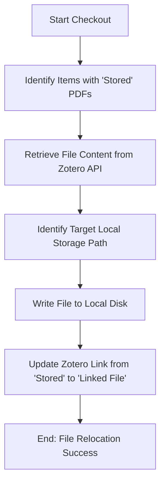

# DOC-SPEC: storage checkout

## 1. Classification
- **Level:** 🟡 MODIFICATION (File Relocation)
- **Target Audience:** SysAdmin / Advanced User

## 2. Logic Flow (Visual Synthesis)

```mermaid
graph TD
    A["Start Checkout"] --> B["Identify Items with 'Stored' PDFs"]
    B --> C["Retrieve File Content from Zotero API"]
    C --> D["Identify Target Local Storage Path"]
    D --> E["Write File to Local Disk"]
    E --> F["Update Zotero Link from 'Stored' to 'Linked File'"]
    F --> G["End: File Relocation Success"]
```

## 3. Synopsis
Moves research files (PDFs) from Zotero's internal cloud storage to your local filesystem, transforming them into "Linked Files" to save cloud space.

## 4. Description (Instructional Architecture)
The `storage checkout` command is a specialized tool for managing Zotero storage quotas. By default, Zotero "stores" files in its own cloud, which has a limited free tier. This command automates the process of "checking out" those files: it downloads them to your pre-configured local storage directory and updates the Zotero metadata to point to the local path instead. 

This allows you to maintain a massive library of PDFs on your own hard drive (or a large external disk) while still having them perfectly indexed and searchable within Zotero. The command ensures that the link remains active, so opening the PDF from the Zotero desktop client will still work correctly.

## 5. Parameter Matrix
| Flag / Parameter | Type | Description | Ergonomic Note |
| :--- | :--- | :--- | :--- |
| `--limit` | Integer | Max items to process | Optional. Default: 50. |
| `--allow-group-library` | Boolean | Check out from a group library anyway | Optional. Group libraries are refused by default: the linked file's local path (with your username) syncs to every member, and the files are missing on their machines. |
| `--execute` | Flag | Check out the files | Mutually exclusive with `--dry-run`. Currently the default for now (see Cognitive Safeguards) - kept for scripts that already pass it and for future-proofing once 4.0 flips the default (Issue #378, #462). |
| `--dry-run` | Flag | Preview what would be checked out without downloading or relinking anything | Mutually exclusive with `--execute`. |

## 6. Scenario-Based Examples (Cognitive Anchors)
### Scenario: Migrating a library to local storage to save cloud space
**Problem:** My Zotero cloud storage is full and I want to move all my PDFs to my computer's "Documents/Zotero_PDFs" folder.
**Action:** `zotero-cli storage checkout --limit 100 --execute`
**Result:** The 100 oldest stored PDFs are downloaded to your local path and their links are updated in Zotero.

### Scenario: Checking what a checkout would move first
**Problem:** I want to see which files would be downloaded and relinked before running it for real.
**Action:** `zotero-cli storage checkout --limit 100 --dry-run`
**Result:** Each file's destination path is listed; nothing is downloaded, relinked, or created on disk.

## 7. Cognitive Safeguards
- **Common Failure Modes:** Attempting a checkout without having a local storage path defined in your `config.toml`. The command will fail if it doesn't know where to save the files. 
- **Safety Tips:** Ensure that your local storage directory is backed up. Once a file is "checked out" and deleted from the Zotero cloud (if that is your secondary goal), your local copy becomes the primary instance. Passing neither `--dry-run` nor `--execute` still checks out immediately today (unchanged 3.x behaviour), but prints a deprecation warning to stderr - pass `--execute` explicitly. This becomes preview-by-default in 4.0 (Issue #378, #462).
