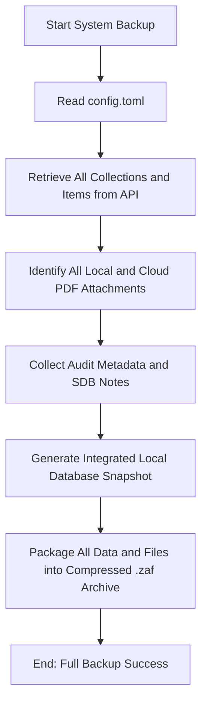

# DOC-SPEC: system backup

## 1. Classification
- **Level:** 🟢 READ-ONLY (Full System Archival)
- **Target Audience:** SysAdmin / Advanced User

## 2. Logic Flow (Visual Synthesis)

## 3. Synopsis
Creates a complete, self-contained backup archive (`.zaf`) of your entire Zotero library (Personal or Group), including all collections, item metadata, attachments, and audit trails.

## 4. Description (Instructional Architecture)
The `system backup` command is the "Ultimate Safety Net" for your research ecosystem. While `collection backup` targets a specific folder, this command performs a full-scale export of the active library context. 

The resulting Zotero Archive Format (`.zaf`) file contains everything needed to reconstruct your entire library state on another machine or at a later date. This includes not just the bibliographic metadata, but also the physical PDF files, the hierarchical collection structure, and the critical Systematic Literature Review (SLR) audit data stored in child notes. This command is essential for long-term project preservation and disaster recovery planning.

## 5. Parameter Matrix
| Flag | Type | Description | Ergonomic Note |
| :--- | :--- | :--- | :--- |
| `--output` | Path | File path where the `.zaf` archive will be saved. | Required. Use `.zaf` extension. |

## 6. Scenario-Based Examples (Cognitive Anchors)
### Scenario: Migrating research data to a new workstation
**Problem:** I've bought a new computer and I want to move my entire `zotero-cli` environment and library state without relying on re-syncing everything from the cloud.
**Action:** `zotero-cli system backup --output "Master_Research_Backup_2024.zaf"`
**Result:** A single portable file is created that can be used with `system restore` on the new machine.

## 7. Cognitive Safeguards
- **Common Failure Modes:** Attempting a full backup on a very large library (>5000 items) without sufficient disk space. The process can also be time-consuming as it must fetch every attachment from the API or local storage. 
- **Safety Tips:** Run this command regularly (e.g., monthly) and store the resulting `.zaf` file in a secure, off-site location (like an encrypted cloud drive or external hardware).
