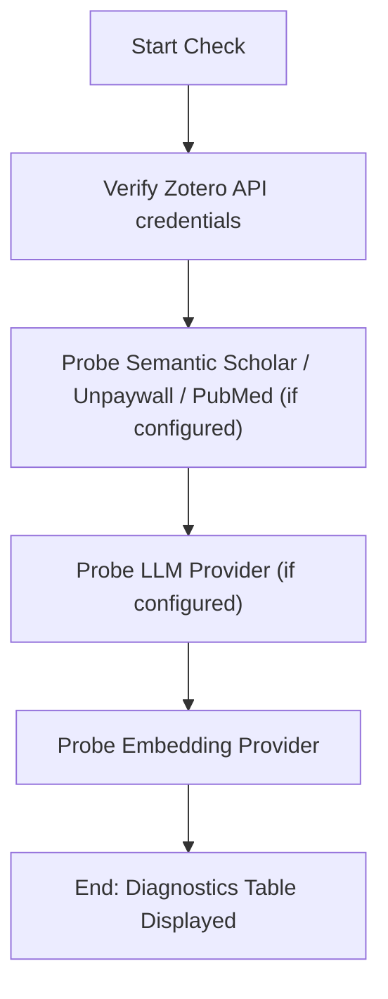

# DOC-SPEC: system check

## 1. Classification
- **Level:** 🟢 READ-ONLY (Diagnostics)
- **Target Audience:** All Users

## 2. Logic Flow (Visual Synthesis)

## 3. Synopsis
Runs lightweight, read-only connectivity and credential checks against every external service `zotero-cli` can be configured to use.

## 4. Description (Instructional Architecture)
The `system check` command is the "Pre-flight Inspection" for `zotero-cli`. Configuration problems (a bad API key, an unreachable network, a missing embedding model) often only surface as a silent failure deep inside another command — an `import doi` that returns nothing, or a `rag ingest` that produces empty results. `system check` surfaces those problems up front.

Each service is reported with one of three statuses:
- **CONNECTED:** The service responded to a live probe.
- **FAILED:** The service is configured but the probe failed (bad credentials, network error, rate limit).
- **NOT CONFIGURED:** No optional credential was set for that service — expected for services you don't use, not an error.

Services checked: Zotero API, Semantic Scholar, Unpaywall, PubMed/NCBI, the configured LLM provider, and the configured embedding provider.

## 5. Parameter Matrix
| Flag / Parameter | Type | Description | Ergonomic Note |
| :--- | :--- | :--- | :--- |

## 6. Scenario-Based Examples (Cognitive Anchors)
### Scenario: A command fails and you don't know why
**Problem:** `import doi` silently returns no metadata and you're not sure if it's a bad key or a network issue.
**Action:** `zotero-cli system check`
**Result:** A table shows each configured service's status (CONNECTED/FAILED/NOT CONFIGURED) with details.

## 7. Cognitive Safeguards
- **Common Failure Modes:** Running this before setting any optional API keys — most rows will show NOT CONFIGURED, which is expected, not an error.
- **Safety Tips:** Run this after editing `config.toml` to confirm the new credentials actually work before a long-running import.
