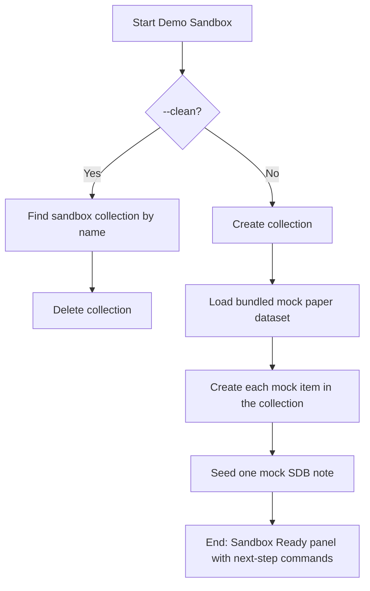

# DOC-SPEC: system demo-sandbox

## 1. Classification
- **Level:** 🟡 MODIFICATION (Creates/deletes a collection and items)
- **Target Audience:** New Users / Onboarding

## 2. Logic Flow (Visual Synthesis)

## 3. Synopsis
Provisions (or tears down) a temporary Zotero collection populated with mock papers, so a new user can immediately try screening, reporting, and RAG commands without risking their real library.

## 4. Description (Instructional Architecture)
The `system demo-sandbox` command is the "Onboarding Fixture" for `zotero-cli`. New users often don't have a populated Zotero collection ready, or are hesitant to run destructive-sounding commands against their live research database on day one.

Running the command with no flags creates a collection (default name `Zotero-CLI Sandbox`) containing 5-10 fictional mock papers with titles, abstracts, authors, and tags, one of which already has a mock SDB screening note attached — enough to immediately try `slr screen`, `report duplicates`, `report prisma`, and `rag ingest` against realistic-looking data.

Running it with `--clean` finds and deletes the named sandbox collection, for tidy removal once onboarding is done.

This command requires a live Zotero API connection (`--offline` mode is read-only and cannot create collections or items).

## 5. Parameter Matrix
| Flag / Parameter | Type | Description | Ergonomic Note |
| :--- | :--- | :--- | :--- |
| `--name` | string | Custom name for the sandbox collection | Defaults to `Zotero-CLI Sandbox` |
| `--clean` | flag | Delete the sandbox collection instead of creating it | Matches `--name` if you used a custom one |

## 6. Scenario-Based Examples (Cognitive Anchors)
### Scenario: Trying zotero-cli for the first time
**Problem:** I just installed zotero-cli and don't have a populated collection I'm comfortable experimenting on yet.
**Action:** `zotero-cli system demo-sandbox`
**Result:** A "Zotero-CLI Sandbox" collection is created with mock papers, ready for `slr screen --source "Zotero-CLI Sandbox"`.

### Scenario: Cleaning up after trying the tool
**Problem:** I'm done exploring and want to remove the mock data from my library.
**Action:** `zotero-cli system demo-sandbox --clean`

## 7. Cognitive Safeguards
- **Common Failure Modes:** Running this in `--offline` mode (the sandbox needs a live, writable Zotero API connection to create real items).
- **Safety Tips:** Use a custom `--name` if you want to keep multiple sandboxes side by side.
