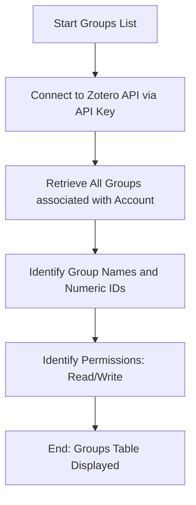

# DOC-SPEC: system groups

## 1. Classification
- **Level:** 🟢 READ-ONLY (Account Discovery)
- **Target Audience:** All Users / Collaborative Lead

## 2. Logic Flow (Visual Synthesis)

## 3. Synopsis
Lists all Zotero groups that your account belongs to, displaying their names, unique numeric IDs, and your access permissions.

## 4. Description (Instructional Architecture)
The `system groups` command is the "Directory Service" for collaborative research. Since many `zotero-cli` commands require a `Group ID` to target a shared library, this command is the primary way to discover those IDs. 

The output is a formatted table that includes:
- **Group ID:** The unique numeric identifier (required for `system switch`).
- **Name:** The human-readable name of the group.
- **Permissions:** Indicates whether you have "Read-only" or "Read/Write" access to that group's library.
This command is essential for researchers who work across multiple labs or projects and need to manage several distinct Zotero libraries.

## 5. Parameter Matrix
*This command does not accept additional parameters.*

## 6. Scenario-Based Examples (Cognitive Anchors)
### Scenario: Finding a lab's Group ID for a new project
**Problem:** I need to move papers into my lab's shared library, but I don't know the numeric ID for the "AI Ethics Lab" group.
**Action:** `zotero-cli system groups`
**Result:** The table lists all my groups, and I can see that "AI Ethics Lab" has ID `1234567`.

## 7. Cognitive Safeguards
- **Common Failure Modes:** Attempting to run the command with an expired or invalid API key. 
- **Safety Tips:** Use this command in combination with `system switch` to move between different project contexts quickly.
